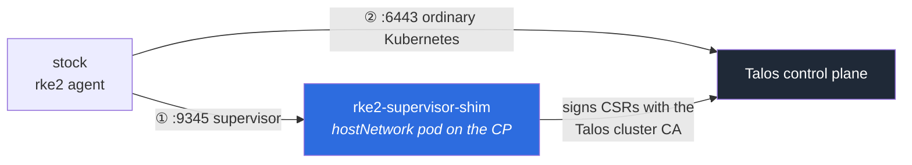

<div align="center">

# rke2-supervisor-shim

**Join stock `rke2 agent` nodes to a Talos Linux control plane.**

Speaks the RKE2 supervisor protocol on port 9345, backed by Talos.<br/>
No changes to the Talos image. No changes to the worker configuration.


</div>

---



## Why

An `rke2 agent` refuses Kubernetes' standard kubelet TLS bootstrap. It will only
take its identity from an rke2 server's supervisor on port 9345 — and
`rke2 server` cannot be reduced to just that supervisor, because its apiserver,
controller manager and scheduler are **static pods run by its own kubelet and
containerd**. (Unlike k3s, where they are goroutines in one process — which is
exactly why k3s has `--disable-agent` and RKE2 has no equivalent.)

So with a Talos control plane and an existing fleet of RKE2 workers, you either
rebuild every worker, or you speak the protocol. This speaks the protocol.

**The load-bearing fact:** the agent POSTs a DER CSR asking for
`O=system:nodes, CN=system:node:<name>` — precisely the identity the Kubernetes
Node authorizer expects. Sign it with the Talos cluster CA and the agent becomes
an ordinary, fully legitimate node. The shim only ever *signs*; no node private
key is ever held or transmitted.

## Status

Verified end to end on Talos v1.13.3 / Kubernetes v1.36.1, with the shim running
as a `hostNetwork` pod on the control-plane node and workers using a completely
stock rke2 agent config.

| RKE2 version | Contract captured | Agent joined | Tunnel |
|---|:---:|:---:|:---:|
| **v1.31.8+rke2r1** | ✅ | ✅ 7/7 functional checks | ✅ |
| **v1.35.7+rke2r1** | ✅ | ✅ 7/7 functional checks | ✅ |

Also verified with **two Talos control-plane nodes**: the DaemonSet starts a
shim on each, control-plane discovery advertises both automatically, and an
agent re-bootstraps and tunnels against the pair.

Functional checks: cross-node pod networking in both directions, ClusterIP
services, cluster DNS, `kubectl logs`, `kubectl exec`.

## Quick start

Install with the Helm chart (see [charts/rke2-supervisor-shim](charts/rke2-supervisor-shim)):

```bash
kubectl -n rke2-shim create secret generic rke2-shim-pki \
  --from-file=cluster-ca.crt=./cluster-ca.crt --from-file=cluster-ca.key=./cluster-ca.key
kubectl -n rke2-shim create secret generic rke2-shim-token \
  --from-literal=token="$(openssl rand -hex 24)"

helm install shim charts/rke2-supervisor-shim \
  --set-file agentConfig.contents=conformance/testdata/v1.31.8+rke2r1/config.json
```

Or apply the raw manifests:

```bash
# 1. Secrets the shim needs
kubectl -n rke2-shim create secret generic rke2-shim-pki \
  --from-file=cluster-ca.crt=./cluster-ca.crt \
  --from-file=cluster-ca.key=./cluster-ca.key

kubectl -n rke2-shim create secret generic rke2-shim-token \
  --from-literal=token="$(openssl rand -hex 24)"

# 2. A /v1-rke2/config captured from a real rke2 server of your version
kubectl -n rke2-shim create configmap rke2-shim-agent-config \
  --from-file=agent-config.json=conformance/testdata/v1.31.8+rke2r1/config.json

# 3. Deploy onto the control-plane node
kubectl apply -f deploy/shim.yaml
```

Workers then use an ordinary rke2 agent config — nothing bespoke:

```yaml
# /etc/rancher/rke2/config.yaml
server: https://<control-plane-ip>:9345
token: <token>
```

> **`hostNetwork` is required, not a convenience.** After bootstrap an agent
> dials `<apiserver-ip>:9345` for the tunnel, taking the address from
> `/v1-rke2/apiservers`. The supervisor must therefore live on the control-plane
> node's own address. This also means the namespace needs
> `pod-security.kubernetes.io/enforce: privileged`, because `baseline` — which
> Talos enforces cluster-wide — forbids `hostNetwork`.

## What it implements

| Endpoint | Notes |
|---|---|
| `GET /cacerts` | unauthenticated by design; the agent pins this CA |
| `GET /v1-rke2/config` | a captured real payload, cluster values overridden |
| `GET /v1-rke2/{client,server}-ca.crt` | Talos' single CA serves for both |
| `POST /v1-rke2/serving-kubelet.crt` | node-scoped; `CN=<node>` + SANs |
| `POST /v1-rke2/client-kubelet.crt` | node-scoped; `O=system:nodes, CN=system:node:<node>` |
| `POST /v1-rke2/client-kube-proxy.crt` | cluster-wide; **no** node headers |
| `POST /v1-rke2/client-rke2-controller.crt` | cluster-wide; **no** node headers |
| `GET /v1-rke2/readyz`, `GET /v1-rke2/apiservers` | |
| `WSS /v1-rke2/connect` | remotedialer tunnel, authenticated by **mTLS** |

Auth is HTTP Basic with the username **literally `node`** and the token as
password, plus `Rke2-Node-{Name,Password,Ip}` headers on the node-scoped calls.

Beyond the protocol: node passwords stored as `kube-system` Secrets in rke2's own
naming and hash format, `CertificateExpirationWarning` events, Prometheus metrics
on `:9346`, and a self-issued, auto-rotating serving certificate.

## Staying compatible with RKE2 upgrades

You cannot guarantee forward compatibility with an undocumented protocol. What
you *can* have is **detection before production**:

- contracts captured from real rke2 servers, committed per version and replayed
  in CI on every merge — no VM required;
- a scheduled job that re-captures from a real server of each supported version
  and **fails on any diff**;
- unknown endpoints return 501 and log at ERROR, so drift announces itself.

Measured across v1.31.8 → v1.35.7 (four minors, roughly two years) the
agent-facing surface is **identical**: same endpoints, auth, headers, methods and
certificate subjects, with 62 of 63 shared config keys byte-identical.

Full reasoning and the upgrade runbook: **[docs/compatibility.md](docs/compatibility.md)**.

## Documentation

| | |
|---|---|
| [docs/architecture.md](docs/architecture.md) | diagrams: topology, bootstrap sequence, trust chain |
| [docs/protocol.md](docs/protocol.md) | every endpoint, header and gotcha — captured, not guessed |
| [docs/compatibility.md](docs/compatibility.md) | upgrade strategy, measured stability, runbook |
| [docs/certificates.md](docs/certificates.md) | lifetimes, renewal, expiry alerting, CA-rotation runbook |
| [docs/security.md](docs/security.md) | audit: four issues fixed, four accepted risks |
| [docs/risk-register.md](docs/risk-register.md) | **every finding, ranked by reasons not to do this** — start here for a go/no-go |
| [docs/kubelet-egress.md](docs/kubelet-egress.md) | how each control plane reaches kubelets, and the measured reachability matrix |
| [docs/migration-from-rke2.md](docs/migration-from-rke2.md) | adopting an existing RKE2 cluster with a Talos CP — **coexistence proven**, incl. Secrets encryption, with RKE2 untouched |
| [docs/runbook.md](docs/runbook.md) | **operating the migration** — phase by phase, with gates, timings and a rollback matrix |
| [docs/control-plane-vip.md](docs/control-plane-vip.md) | the VIP through the migration: kube-vip config per phase, and how the failover to Talos actually happens |
| [docs/benchmarks.md](docs/benchmarks.md) | what the supervisor costs — ~9 bootstraps/s per control plane, and why |
| [examples/adopt-rke2-cluster/preflight.sh](examples/adopt-rke2-cluster/preflight.sh) | **run this first** — reads the live cluster and refuses to generate a config that would inherit a Talos default |
| [examples/adopt-rke2-cluster/adopt.sh](examples/adopt-rke2-cluster/adopt.sh) | phased driver: `status`, `preflight`, `cilium`, `pki`, `join`, `shim`, `migrate-worker`, `decommission` |
| [examples/kube-vip/](examples/kube-vip/) | working control-plane VIP manifests for both distributions, and the ~0.7 s handover |
| [docs/network-security.md](docs/network-security.md) | why NetworkPolicy cannot protect this, and what does |
| [CLAUDE.md](CLAUDE.md) | conventions for AI assistants working in this repo |

## Known gaps

- **The pod holds the cluster CA private key**, so compromising it compromises
  the cluster. Unavoidable: `serving-kubelet` and the two cluster identities have
  no built-in Kubernetes signer that fits. Contained with a distroless nonroot
  image, read-only rootfs, dropped capabilities and least-privilege RBAC.
- **Metrics on `:9346` are unauthenticated** on the host network. NetworkPolicy
  cannot protect it — see [docs/network-security.md](docs/network-security.md)
  for the Talos ingress firewall that can, verified on a live node.
- **CA rotation is a manual runbook**, deliberately not automated.
- **Expiry warnings are verified synthetically**, never by a genuinely aged
  certificate.
- **CNI on workers differs by RKE2 version**: v1.35.7 populates `/opt/cni/bin`,
  v1.31.8 leaves it empty. A worker-provisioning concern, but it bites.
- **During coexistence the Talos API server cannot reach un-migrated RKE2
  kubelets** (`401`). Talos has one signing key where RKE2 has two, so its
  `apiserver-kubelet-client` cert chains to `server-ca` while RKE2 kubelets
  validate against `client-ca`. Structural, but it **shrinks as you migrate**,
  and migrated workers are reachable from both control planes. See
  [docs/kubelet-egress.md](docs/kubelet-egress.md).
- **Talos ships a newer etcd than RKE2 bundles.** The cluster version pins to
  the lowest member, so removing the last RKE2 control plane silently upgrades
  it — a one-way door. Snapshot etcd immediately before that step.

If you are adopting a live RKE2 cluster, do not hand-write the machine config —
run [`preflight.sh`](examples/adopt-rke2-cluster/preflight.sh). Most of the
findings above began as a value Talos defaulted to something plausible and
wrong; it exists to make that class of mistake impossible.

## Development

```bash
go test ./...   # replays captured protocol contracts; no cluster required
go vet ./...
```

CI publishes a multi-arch (`amd64` + `arm64`) image with **ko** rather than
buildx: the shared runner has no privileged dind, and ko cross-compiles Go
natively instead of emulating arm64 under QEMU.

## Licence

MIT — see [LICENSE](LICENSE). Uses [`rancher/remotedialer`](https://github.com/rancher/remotedialer)
(Apache-2.0) so the tunnel wire format is identical by construction rather than
reimplemented.
