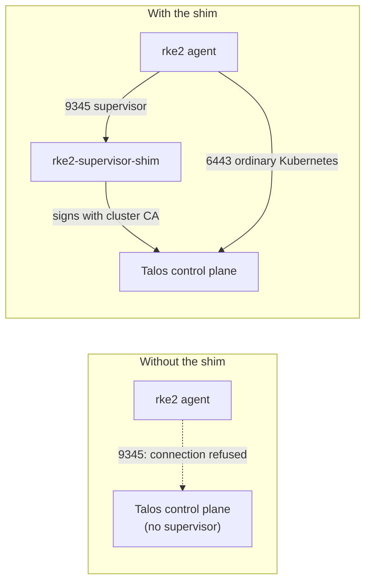
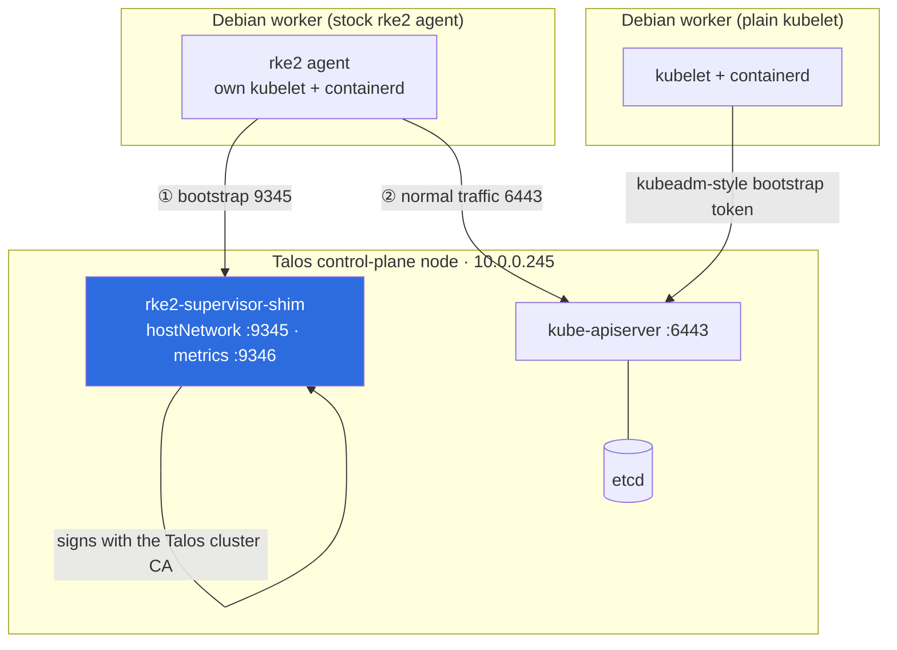
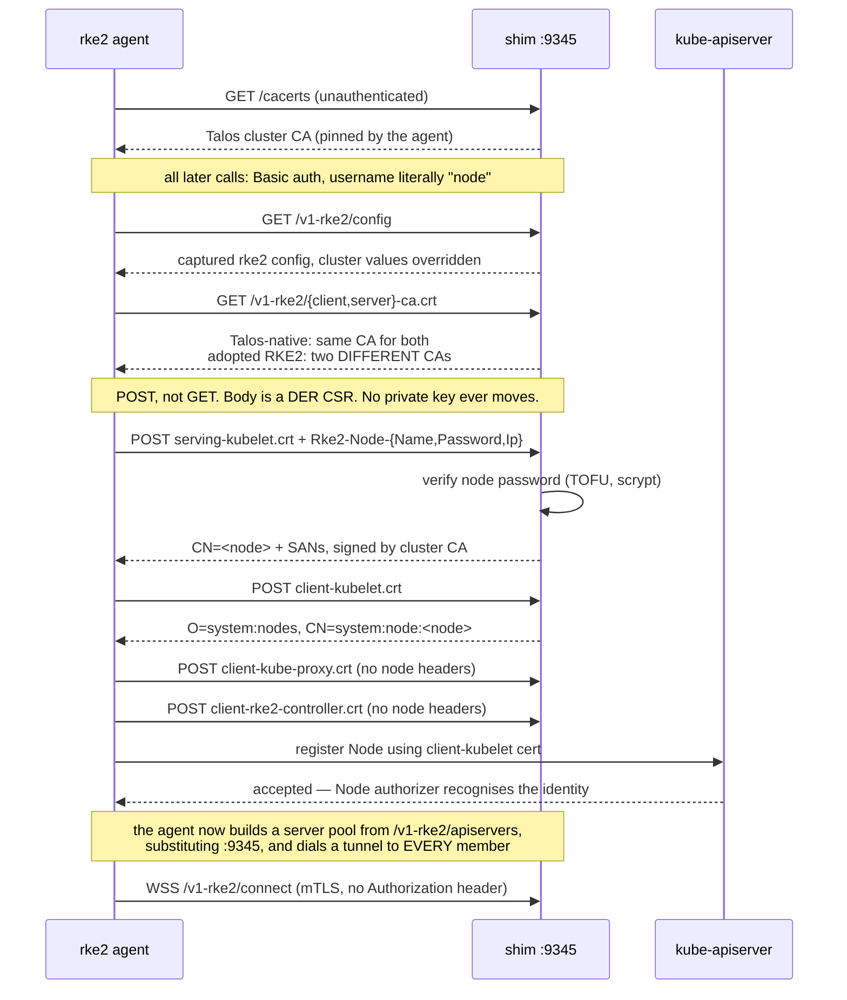
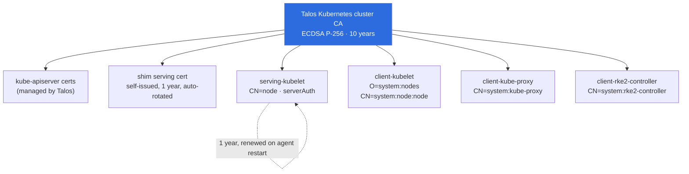
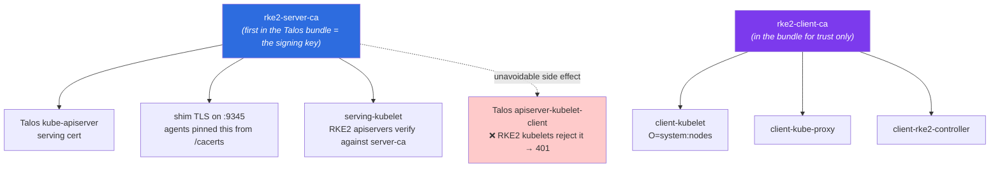
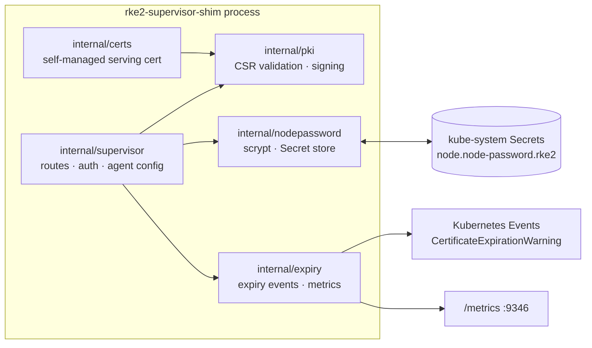

# Architecture

## The problem in one picture

An `rke2 agent` will not use Kubernetes' standard kubelet TLS bootstrap. It
fetches its identity from an rke2 server's supervisor on port 9345 and nowhere
else. A Talos control plane has no such thing.

`rke2 server` cannot be reduced to a supervisor: its apiserver, controller
manager and scheduler are **static pods run by its own kubelet and containerd**.
Unlike k3s — where they are goroutines in one process, which is why k3s has
`--disable-agent` and RKE2 has no equivalent — you cannot run "just the
supervisor" part.

## Deployment topology

The shim runs **on** the control-plane node with `hostNetwork`, because the
configured `server:` URL is only a seed. After bootstrap the agent builds a
server pool from `/v1-rke2/apiservers`, **substituting port 9345 into each
apiserver address**, and dials those. It therefore assumes every apiserver also
runs a supervisor — so a control-plane node without one becomes a dead backend.
Co-location is a protocol requirement, not a preference.

The Talos image is never modified: no system extensions, no custom installer.
The shim is an ordinary workload; everything else is machine config.

## Bootstrap sequence

Reverse-engineered by proxying a real agent through a logging MITM to a real
rke2 server. Full details in [protocol.md](protocol.md).

**The load-bearing fact** is that fourth exchange. `O=system:nodes,
CN=system:node:<node>` is exactly the identity the Kubernetes Node authorizer
expects. Sign that CSR with the Talos cluster CA and the agent is an ordinary,
fully legitimate member of the cluster. Everything else is plumbing around that.

## Trust chain

There are **two** shapes here, and conflating them is the single most expensive
mistake in this project.

### A Talos-native cluster: one CA

Talos keeps a single cluster CA where rke2 keeps three. Collapsing them is safe
*here* because nothing in the cluster was issued by anyone else — what matters is
that the kubelet's client certificate chains to the CA the apiserver trusts.

### An adopted RKE2 cluster: two signers, and they are not interchangeable

Existing rke2 agents already pinned `server-ca`, and existing RKE2 apiservers
already trust only `client-ca` for clients. Collapsing them here breaks live
nodes. This is why the shim takes `--serving-ca-cert/--serving-ca-key` as a
**separate** signer from its default CA:

The dotted edge is the one cost of that ordering: Talos signs its own
`apiserver-kubelet-client` cert with the same key, and RKE2 kubelets validate
client certs against `client-ca` only. Reversing the bundle does not fix it, it
breaks the agents' pin instead. See [kubelet-egress.md](kubelet-egress.md) and
[certificates.md](certificates.md).

The shim holds a CA private key — see [security.md](security.md) for why that
is unavoidable and how it is contained.

## Component map

## Design decisions worth knowing

**The agent config is a captured real response, not hand-written structs.**
`/v1-rke2/config` has 65 keys. The shim loads a JSON document captured from a
real rke2 server and overrides about ten. When RKE2 adds a field, agents get
what the real server sent instead of a zero value. See
[compatibility.md](compatibility.md).

**Unknown endpoints fail loudly.** A 501 plus an ERROR log naming the path, so
protocol drift announces itself rather than degrading quietly.

**Certificate subjects are chosen by the endpoint, never taken from the CSR.**
An agent cannot request an arbitrary identity by crafting its request.

**Node passwords are Secrets, not local state.** Same name, namespace and hash
format as rke2, so they survive rescheduling and an operator can clear one with
familiar tooling. The hash is byte-compatible in **both** directions — verified
by having the shim author one and a stock `rke2-server` accept it — so shims and
real servers can sit behind the same VIP.

**The DaemonSet is pinned by an empty-string label match.** Talos labels control
planes `node-role.kubernetes.io/control-plane: ""`, RKE2 labels them `"true"`.
Selecting on `""` is what keeps the shim off the RKE2 servers, where
`rke2-server` already owns `:9345`. It reads like a typo and is not; see the
comment in `deploy/shim.yaml`.

**The shim is deliberately not load-bearing for a running node.** Agents keep a
persisted server pool and fan their tunnels out to all of it, so an agent that
has bootstrapped once survives the shim being down — verified by restarting one
while its configured server was dead. Only a node's *first* bootstrap needs the
shim specifically, and only if it is the sole supervisor it knows.
