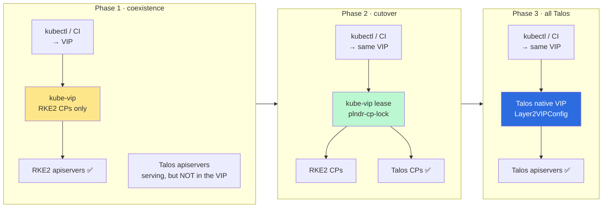
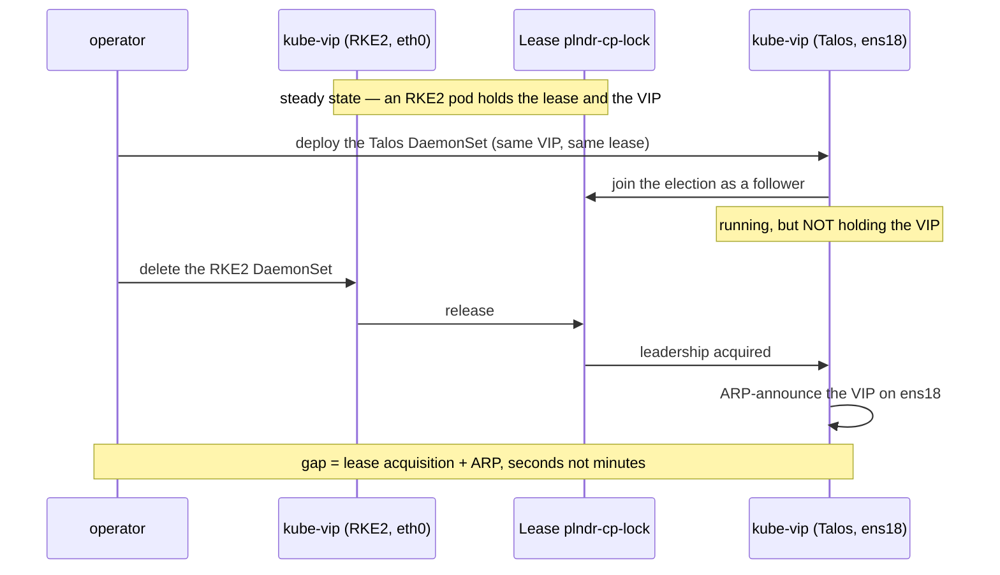

# The control-plane VIP, and how the failover to Talos actually happens

The migration docs say "keep your kubeconfig on the RKE2 API servers during
coexistence". That raises the obvious question: **you are not typing node IPs,
you are using a VIP — so what does the VIP point at, and when does it move?**

This document answers that, and it turns out the VIP is not just plumbing: it is
what *enforces* the coexistence rule, so you do not have to rely on operator
discipline.

## 🎯 The idea in one line

> **VIP membership is the enforcement mechanism.** While the VIP can only land on
> RKE2 control planes, every `kubectl logs`/`exec` works by construction — nobody
> can accidentally hit the Talos API server and get a `401`.



## ⚠️ Why you cannot just "add Talos to the existing kube-vip"

Three asymmetries, all measured on a live mixed cluster. Each one silently
breaks a naive single-DaemonSet setup:

| | RKE2 (Debian) | Talos |
|---|---|---|
| LAN interface | `eth0` | `ens18` |
| `node-role.kubernetes.io/control-plane` | `"true"` | `""` (empty) |
| control-plane taint | none | `NoSchedule` |

- 🔌 **The interface name differs**, on the same hypervisor with the same virtio
  NIC — Talos uses predictable names, the Debian image does not. kube-vip binds
  `vip_interface` to one name, so one DaemonSet cannot serve both.
- 🏷️ **The label *value* differs.** kube-vip's generated manifest uses
  `operator: Exists`, which matches **both** — convenient here, and exactly the
  opposite of what the shim needs. Selecting on the *value* is what lets you aim
  a DaemonSet at one distro or the other.
- 🚫 **Talos control planes are tainted**, RKE2 ones are not. Anything targeting
  both needs the tolerations (`kube-vip manifest daemonset --taint` emits them).

## 🅰️ Phase 1 — coexistence: kube-vip on RKE2 only

Pin it by label **value**, not existence:

```yaml
# kube-vip DaemonSet (excerpt) — RKE2 control planes only
spec:
  template:
    spec:
      hostNetwork: true
      nodeSelector:
        node-role.kubernetes.io/control-plane: "true"   # "true" = RKE2 only
      containers:
        - name: kube-vip
          env:
            - {name: vip_interface,      value: "eth0"}
            - {name: address,            value: "192.0.2.10"}   # your VIP
            - {name: port,               value: "6443"}
            - {name: cp_enable,          value: "true"}
            - {name: vip_arp,            value: "true"}
            - {name: vip_leaderelection, value: "true"}
            - {name: vip_leasename,      value: "plndr-cp-lock"}
          securityContext:
            capabilities:
              add: [NET_ADMIN, NET_RAW, SYS_TIME]
```

If you already run kube-vip, this is likely what you have minus the explicit
`nodeSelector`. **Add the selector before adopting the first Talos node** — with
`operator: Exists` affinity, kube-vip would otherwise schedule onto Talos CPs the
moment they appear, and the VIP could start answering from an API server that
cannot reach your un-migrated kubelets.

## 🅱️ Phase 2 — the cutover, without an outage

Do **not** hand the IP over by stopping one thing and starting another; that
leaves the address unowned while ARP reconverges. Instead run **two DaemonSets
that share one lease**.

kube-vip's leader election is a Kubernetes `Lease` (`plndr-cp-lock`). Two
DaemonSets with different selectors and different `vip_interface` values, but the
**same lease name and same VIP**, form a single election. Only one pod holds the
address at any moment, and the handover is the normal leader transition.



The second DaemonSet is the same manifest with three changes:

```yaml
      nodeSelector:
        node-role.kubernetes.io/control-plane: ""       # "" = Talos only
      tolerations:
        - key: node-role.kubernetes.io/control-plane
          operator: Exists
          effect: NoSchedule
      # ... and
            - {name: vip_interface, value: "ens18"}
```

> 🛑 **Order matters.** Only deploy the Talos DaemonSet once **every worker is
> migrated**. From the moment the VIP can land on Talos, `kubectl logs`/`exec`
> against any remaining un-migrated RKE2 kubelet will fail with `401` — see
> [kubelet-egress.md](kubelet-egress.md). Phase 2 is the last step before
> decommissioning, not a parallel activity.

## 🅲 Phase 3 — end state: drop kube-vip for Talos' native VIP

Once the cluster is all-Talos, you no longer need kube-vip for the control
plane. Talos has this built in, elected among control-plane nodes:

```yaml
apiVersion: v1alpha1
kind: Layer2VIPConfig
name: 192.0.2.10      # the VIP
link: ens18
```

(The older `machine.network.interfaces[].vip.ip` form still works on 1.13.)

Two caveats worth knowing before you rely on it:

- 🗳️ **It is elected through etcd.** If etcd is down the VIP is unavailable —
  which is why Sidero recommend *not* reaching the Talos API itself over the VIP:
  you would lose the interface you need to fix etcd. Keep node IPs in your
  `talosconfig` endpoints.
- 🚧 **It only coordinates between Talos nodes.** It cannot share an address with
  kube-vip, so there is no overlap window — this is why the handover happens in
  Phase 2 while kube-vip still owns the IP, and Phase 3 is a later, separate
  change made when no RKE2 node remains.

## 🧪 Verified on a live mixed cluster

The whole sequence above was run end to end against 1 RKE2 control plane and
2 Talos control planes sharing one etcd:

| Check | Result |
|---|---|
| 🧬 kube-vip runs on **Talos** | ✅ `1/1 Running` on both Talos CPs |
| 🅰️ Phase 1 — VIP pinned to RKE2 | ✅ VIP live, lease held by the RKE2 CP, `kubectl` served |
| 🅱️ Handover to Talos | ✅ lease moved, API kept serving |
| ⏱️ **Handover outage** | ✅ **~0.7 s** (7 lost pings at 100 ms), 1.17 % loss over a 62 s window |
| 🔁 Handover back to RKE2 | ✅ symmetric, same mechanism |

**The capability worry was unfounded.** Unlike Cilium — which needs the whole
bounding set spelled out (see [risk-register.md](risk-register.md) #3) —
kube-vip starts on Talos with nothing more than:

```yaml
securityContext:
  capabilities:
    add: [NET_ADMIN, NET_RAW, SYS_TIME]
```

### 🔑 Use the RKE2 admin kubeconfig, not the Talos one

Discovered while testing this, and it is a stronger reason to "keep the
kubeconfig on RKE2" than the logs/exec rule:

| kubeconfig | against RKE2 apiservers | against Talos apiservers |
|---|---|---|
| **RKE2 admin** (`/etc/rancher/rke2/rke2.yaml`) | ✅ | ✅ |
| Talos admin (`talosctl kubeconfig`) | ❌ `must be logged in` | ✅ |

The Talos admin client cert is signed by `server-ca` (first in the bundle), and
RKE2 apiservers set `--client-ca-file` to `client-ca` **only**, so they reject
it. Talos trusts the two-cert bundle and therefore accepts both. **The RKE2
admin kubeconfig is the one credential that works everywhere** for the whole
migration — point it at the VIP and it keeps working across the handover.

## 🤖 In-cluster clients (Rancher agents, operators) — you cannot steer them

The VIP fixes humans and CI. It does **not** fix anything running *inside* the
cluster, and that is a separate problem worth understanding before you start.

In-cluster clients use the `kubernetes` Service ClusterIP, and its endpoints are
registered by **every** API server independently — including the Talos ones:

```
$ kubectl -n default get endpoints kubernetes
10.0.0.11   10.0.0.12   10.0.0.13      # RKE2 and Talos, mixed
```

There is no VIP to point them at and no way to exclude the Talos members. So a
`cattle-cluster-agent`, an operator, or any controller will land on a Talos API
server a fraction of the time, proportional to how many there are.

Two consequences during coexistence:

- 🎫 **Rancher's "View logs" / "Execute shell" on pods sitting on *un-migrated*
  RKE2 nodes fails intermittently** with the `401` from
  [kubelet-egress.md](kubelet-egress.md) — whenever the agent's request happens
  to land on a Talos API server.
- 🔐 **If the CIDRs were left at the Talos default, everything in-cluster breaks
  intermittently**, not just Rancher — the Talos serving cert then carries the
  wrong `kubernetes` ClusterIP. Observed directly: a hand-built Talos node
  advertises `10.96.0.1` while the cluster uses `10.43.0.1`, so every in-cluster
  TLS handshake to that node fails. A node built through `preflight.sh` has the
  correct SAN. This is [risk-register.md](risk-register.md) #4b, and it is the
  more damaging of the two.

### ✅ The fix: make the Talos API servers withdraw from the Service

You do **not** need to keep Rancher agents on RKE2 nodes — scheduling is
irrelevant. And you do not need to patch each workload either. Tell the **Talos**
API servers not to register themselves:

```yaml
cluster:
  apiServer:
    extraArgs:
      # COEXISTENCE ONLY. Withdraws this API server from the `kubernetes`
      # Service, so in-cluster clients reach RKE2 only and never meet the 401.
      # MUST be removed before the last RKE2 control plane goes.
      endpoint-reconciler-type: none
```

The endpoint list is maintained by a lease-based reconciler in which each API
server enrols itself; with `none`, a Talos node simply stops enrolling. Measured
on the live cluster — endpoints went from three to one within 20 s:

```
before:  10.0.0.11  10.0.0.12  10.0.0.13     # 2 Talos + 1 RKE2
after:   10.0.0.12                            # RKE2 only
```

Both Talos API servers **kept serving normally** throughout, on their own
addresses and through the VIP; nodes stayed `Ready`, and the in-cluster clients
running on those nodes logged no errors. Only the *advertisement* changes.

> 🛑 **Remove this before decommissioning the last RKE2 control plane.**
> Otherwise no API server is enrolled and every in-cluster client loses the API
> at once. `adopt.sh decommission` refuses to remove the final RKE2 control plane
> while the flag is still set.

> ⚠️ Also note that in-cluster traffic then depends **solely** on the RKE2 API
> servers for the duration. Fine with three of them; think twice with one.

<details>
<summary>Per-workload alternative, if you would rather not touch the API servers</summary>

`client-go` honours `KUBERNETES_SERVICE_HOST`/`PORT`, so an individual workload
can be pinned to the VIP instead:

```bash
kubectl -n cattle-system set env deployment/cattle-cluster-agent \
  KUBERNETES_SERVICE_HOST=<VIP> KUBERNETES_SERVICE_PORT=6443
```

This only works if the VIP is in the API server certificate SANs, and it has to
be repeated for every controller that does `logs`/`exec`. The reconciler setting
above covers them all at once.
</details>

## 📜 The VIP must be in the certificate SANs on BOTH sides

Easy to miss, because a human can paper over it with
`--insecure-skip-tls-verify` — which is exactly what we did while measuring the
handover, so that test did **not** exercise TLS validation.

- **RKE2**: the VIP must be in `tls-san` in `/etc/rancher/rke2/config.yaml`. If
  you already run a VIP in production it is already there, and no RKE2 change is
  needed. **If it is not, adding it means touching RKE2** — the one thing this
  whole approach otherwise avoids — so plan it deliberately, ideally before the
  migration starts. Introducing a *new* VIP as part of the migration is what
  forces that change; reusing the existing one does not.

  What it looks like when only the Talos side is done — the VIP resolves to an
  RKE2 API server whose certificate never heard of it:

  ```
  Unable to connect to the server: tls: failed to verify certificate:
    x509: certificate is valid for 10.0.0.11, 10.0.0.12, 127.0.0.1, 10.43.0.1,
    not <VIP>
  ```
- **Talos**: set it explicitly in the machine config:

  ```yaml
  cluster:
    apiServer:
      certSANs:
        - <VIP>
  ```

  Talos *does* pick the VIP up automatically once a node has actually held it —
  we watched `192.0.2.x` appear in the `k8s` CertSAN resource after kube-vip
  assigned it. But that happens **after** the first handover, which is too late
  for the clients validating TLS during it. Declare it up front.

### Remaining notes

- 🔗 **Point kube-vip at the local API server, not the ClusterIP.** Set
  `KUBERNETES_SERVICE_HOST=127.0.0.1` / `PORT=6443`. The component that provides
  the API VIP must not depend on service routing to elect itself. It also avoids
  the Talos apiserver SAN issue if your `serviceSubnets` were left at the Talos
  default ([risk-register.md](risk-register.md) #4b). Do **not** use
  `127.0.0.1:7445` — KubePrism is disabled during coexistence (#13).
- 📛 **Interface names are per-node.** If your Talos nodes do not all present the
  same NIC name, one `vip_interface` per DaemonSet is not enough — normalise with
  Talos' `deviceSelector`, or split further.
- 🔀 **Cilium in kube-proxy-replacement mode** does not interfere: a
  control-plane VIP in ARP mode is independent of kube-proxy. kube-vip's
  *service* LoadBalancer mode is a separate question, out of scope here.
- 🧹 **Do not remove the last RKE2 control plane while the VIP is pinned to
  RKE2** — the address would simply disappear. Phase 2 comes first.

## 📋 Summary

| Phase | VIP owner | Selector | Why |
|---|---|---|---|
| 1 · coexistence | RKE2 CPs | `control-plane: "true"` | makes the kubectl rule structural, not a convention |
| 2 · cutover | either, by lease | two DaemonSets, one lease | handover in seconds, no unowned address |
| 3 · all Talos | Talos native | `Layer2VIPConfig` | one less component; etcd-elected |

The failover is therefore **not a cutover event you schedule at 3 a.m.** It is a
leader election you trigger by deploying one DaemonSet and deleting another,
after the workers are already migrated — **measured at ~0.7 s of VIP outage**,
with the API served throughout by whichever apiservers are up.
