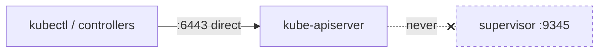
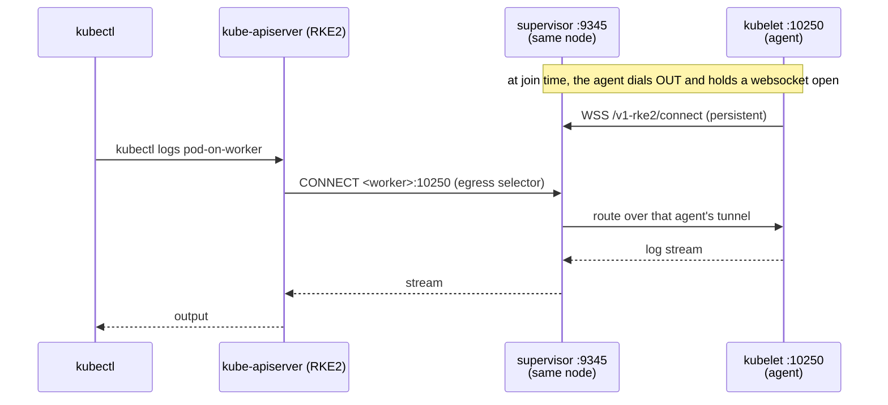
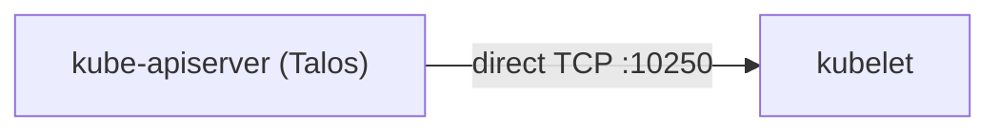
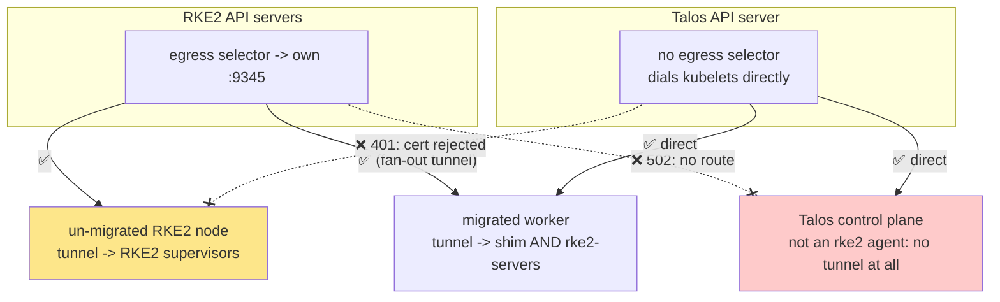

# How the control plane reaches kubelets

RKE2 and Talos answer this question differently, and that single difference
explains most of the surprises in a mixed cluster. It is worth understanding
before planning a migration, because it is a **routing** property, not a trust
one — no amount of certificate work changes it.

## `rke2-server` is not a proxy for the API server

A common first guess is that `:9345` sits in front of the API server. It does
not. Client traffic goes straight to `:6443`; `kubectl` never touches `:9345`.

The proxying is in the **other direction** — outbound, from the API server into
the cluster.



`:9345` carries three separate jobs, which is why it is easy to conflate them:

| | Role | Who talks to it |
| --- | --- | --- |
| 1 | **bootstrap API** — hands out certs and agent config | joining agents |
| 2 | **tunnel broker** — terminates remotedialer websockets | every agent, continuously |
| 3 | **egress proxy** — routes API-server-originated traffic | the local API server |

Job 3 is the one that matters here.

## The egress selector

RKE2 starts its API server with an egress-selector configuration:

```
--egress-selector-config-file=/var/lib/rancher/rke2/server/etc/egress-selector-config.yaml
```

```json
{"kind":"EgressSelectorConfiguration",
 "egressSelections":[{"name":"cluster",
   "connection":{"proxyProtocol":"HTTPConnect",
     "transport":{"tcp":{"url":"https://127.0.0.1:9345", ...}}}}]}
```

So for the **`cluster`** egress selection — kubelets on `:10250` (`logs`, `exec`,
`attach`, `port-forward`, metrics), webhooks, aggregated APIs — the API server
does **not** dial the target. It issues an HTTP `CONNECT` to its **own local
supervisor**, which then routes over the websocket tunnel the agent opened
*outbound* to it.



The tunnel is established **agent → server**, which is what makes RKE2 work with
agents behind NAT or firewalls: nothing has to dial *into* a worker.

## Talos does the obvious thing

Talos configures no egress selector. Its API server dials `<node>:10250`
directly over the network and verifies the kubelet's serving certificate against
the cluster CA.



Simpler, and it requires the control plane to have network reachability to every
node — which is normally true and is the assumption Kubernetes makes by default.

## What this means in a mixed cluster

> **This section was rewritten after measuring it.** An earlier version claimed
> RKE2 API servers could not reach migrated workers, and called it an unfixable
> routing problem. That was wrong — it was diagnosed against a kubelet still
> holding a serving cert issued before the dual-CA fix landed. The corrected
> picture is below, and it is better news than the original.

The decisive fact is one the protocol capture makes obvious once you look for
it: **an agent does not pick one supervisor, it dials them all.**

```
Connecting to proxy  url="wss://<shim>:9345/v1-rke2/connect"
Connecting to proxy  url="wss://<rke2-cp-1>:9345/v1-rke2/connect"
Connecting to proxy  url="wss://<rke2-cp-2>:9345/v1-rke2/connect"
```

That is a fan-out, not a failover, and real `rke2-server`s accept a migrated
worker's tunnel (`Handling backend connection request [worker]`). So a migrated
worker keeps a live tunnel into *every* RKE2 API server's egress selector, and
stays reachable from all of them. Migrating a worker costs you no visibility.

What is left is a partition along a different axis — **each control plane is
blind to the other's native nodes**, for two entirely different reasons:



**The `502` is a routing failure** and genuinely not fixable with PKI:

```
Error from server: Get "https://<talos-ip>:10250/containerLogs/...":
proxy error from 127.0.0.1:9345 while dialing <talos-ip>:10250, code 502
```

The RKE2 API server asked **its own** supervisor to reach the node, and no
supervisor has a tunnel for it — a Talos control plane is not an rke2 agent, so
it never dialled one. A missing route, not a rejected certificate.

**The `401` is the opposite: pure PKI, and structural.** The Talos API server
dials un-migrated RKE2 kubelets directly and is turned away:

```
error: Internal error occurred: unable to upgrade connection: Unauthorized
```

Talos has **one** signing key; RKE2 has two. The imported bundle is
`server-ca`-first — deliberately, because agents must trust the Talos API
server's serving cert — so Talos signs its `apiserver-kubelet-client` cert with
`server-ca` too. RKE2 kubelets validate client certs against `client-ca` only,
and reject it. Reversing the bundle order does not fix this, it just moves the
breakage onto the agents. See [certificates.md](certificates.md).

## ✅ The operational answer: don't move the kubeconfig yet

The rule is simpler than the matrix suggests, and it is one rule rather than a
per-node decision:

> **For the entire coexistence window, keep your kubeconfig — and any VIP in
> front of `:6443` — pointed at the RKE2 API servers. Do not switch to the Talos
> API server until the last RKE2 control plane is about to go.**

Measured on a live mixed cluster, from an RKE2 API server:

| target | `logs` | `exec` |
|---|---|---|
| RKE2 control-plane nodes | ✅ | ✅ |
| migrated workers | ✅ | ✅ |
| un-migrated workers | ✅ | ✅ |
| **Talos control-plane nodes** | ❌ `502` | ❌ `502` |

So **every workload node is reachable, always**. The only gap is the Talos
control-plane nodes themselves — and for those you already have the better tool:

```bash
talosctl -n <talos-ip> logs -k kube-system/<pod>:<container>
talosctl -n <talos-ip> containers -k
talosctl -n <talos-ip> dmesg
talosctl -n <talos-ip> logs kubelet
```

`talosctl` does not depend on the Kubernetes API at all, which is precisely what
you want when you are debugging a control-plane node. You need it to operate
Talos regardless, so this is not an extra burden.

> 💡 **Make this structural, not a convention.** If you front `:6443` with a VIP,
> pin it to RKE2 control planes for the whole coexistence window — then the VIP
> *cannot* resolve to a Talos API server and nobody can trip this by accident.
> See [control-plane-vip.md](control-plane-vip.md), which also covers handing the
> VIP over to Talos without an unowned-address gap.

The moment the last RKE2 control plane is removed, the `502` disappears with it
and the Talos API server reaches everything.

### Why the `401` is not worth fixing

Two routes were tried on a live Talos 1.13.3 node. **Both are closed**, and both
took the node down while proving it:

**1. Point the flags at RKE2's own credential via `extraArgs`.** RKE2's API
server uses `O=system:masters, CN=system:apiserver` signed by `client-ca` —
exactly what its kubelets accept, and `system:masters` settles authorization
too. Handing Talos that same file should work. Talos refuses:

```
error updating static pod for "APIServerConfigs.kubernetes.talos.dev":
  extra arg "kubelet-client-certificate" is not allowed
```

**2. Shadow the file with `extraVolumes`**, the same trick that solves the
Secrets-encryption key name. This one is more interesting — it fails on an
unrelated limit:

```
invalid pod: spec.volumes[4].name: Invalid value:
  "system-secrets-kubernetes-kube-apiserver-apiserver-kubelet-client-crt"
```

Talos derives the volume name from the **mount path**, and
`/system/secrets/kubernetes/kube-apiserver/apiserver-kubelet-client.crt` yields
**69 characters** against Kubernetes' 63-character limit. The static pod is
rejected, the API server never starts, and the node goes `NotReady` with a
circular `Authorization error ... nodes/proxy` in the logs that points nowhere
near the real cause. Worth knowing generally: **any Talos `extraVolumes`
mountPath longer than ~63 characters silently breaks the static pod.**

Since the operational answer above costs nothing and covers every workload node,
the remaining gap is not worth a fragile workaround — such as mounting the whole
secrets directory, which would also defeat Talos' certificate rotation.

## Two things this retro-explains

**`EgressSelectorMode` in the agent config.** The captured `/v1-rke2/config`
carries `"EgressSelectorMode":"agent"` — that field *is* this mechanism. Setting
it to `"disabled"` to quieten the shim's tunnel reconnects had no effect,
because the tunnel is how the control plane reaches the agent, not something the
agent opts into.

**Why the shim exists at all.** The README frames it as agents needing a
supervisor to *join*. This is the same coin's other face: an RKE2 agent also
needs a supervisor to stay **reachable**. A Talos control plane provides neither
until the shim does.
