# Migrating an RKE2 cluster to Talos control planes

**Status: coexistence WORKS.** A Talos control-plane node has been joined to a
live RKE2 cluster — sharing its etcd, serving its API — with no modification to
the RKE2 control plane, no modification to the Talos image, and no downtime.

Secrets encryption-at-rest, previously the last blocker, is **solved** with a
Talos-side override that requires no RKE2 change at all.

Verified 2026-08-13 against RKE2 v1.31.8+rke2r1 and Talos v1.13.3, on a cluster
shaped like production: 3 RKE2 control planes, an RKE2 worker, Cilium in
kube-proxy-replacement mode, Secrets encryption enabled.

**For a go/no-go decision, read [risk-register.md](risk-register.md) first** —
every finding ranked by how strongly it argues against doing this.

## The goal

Production clusters run RKE2 control planes and RKE2 workers with Cilium in
kube-proxy-replacement mode. Replace the RKE2 control planes with Talos ones,
progressively, with:

- **no control-plane downtime**, not even minutes;
- RKE2 and Talos control planes **coexisting in the same cluster** meanwhile.

## What works, proven

| | |
| --- | --- |
| Talos imports RKE2's PKI | ✅ `talosctl gen secrets --from-kubernetes-pki` |
| One `cluster.ca` covering RKE2's `server-ca` + `client-ca` | ✅ 2-cert bundle |
| Talos joins RKE2's **etcd** as a voting member | ✅ `started`, not a learner |
| Talos etcd health | ✅ `Running / OK`, survives reboot |
| Talos `kube-apiserver` serves the RKE2 cluster | ✅ sees every RKE2 node and pod |
| Write via Talos API → read via RKE2 API | ✅ |
| Write via RKE2 API → read via Talos API | ✅ |
| **Secrets** readable both ways, incl. pre-existing ones | ✅ with the encryption override, RKE2 untouched |
| Talos node registers as a `Node` | ✅ follows automatically once Secrets decrypt |
| RKE2 control plane unaffected throughout | ✅ never lost a beat |
| Same, on a live **3-node** RKE2 cluster | ✅ independently reproduced (issue #1) |

Two apiservers from two distributions, one etcd, one cluster:

```mermaid
flowchart TB
    W["migrated rke2 agent"]
    U["un-migrated rke2 agent"]

    subgraph taloscp["Talos control plane · adopted"]
        SH["rke2-supervisor-shim<br/>:9345"]
        TA["kube-apiserver"]
        E3[("etcd 3.6")]
    end

    subgraph rke2cp["RKE2 control planes · unmodified"]
        RS["rke2-server supervisor<br/>:9345"]
        RA["kube-apiserver"]
        E1[("etcd 3.5")]
        E2[("etcd 3.5")]
    end

    W -- "tunnel" --> SH
    W -- "tunnel · fan-out" --> RS
    U -- "tunnel" --> RS

    E3 <-. "raft peers · :2380 only" .-> E1
    E3 <-. "raft peers · :2380 only" .-> E2

    style SH fill:#2d6cdf,color:#fff
    style E3 fill:#2d6cdf,color:#fff
```



Three things in that picture are the whole design. The Talos member joined over
the **peer** protocol only, never the etcd client call RKE2 rejects. The migrated
agent holds tunnels to **both** supervisors, so neither control plane loses sight
of it. And the RKE2 side is untouched throughout — every accommodation is made on
the Talos side or inside the shim.

## Start here: run the preflight

> 📖 **Running this for real?** [runbook.md](runbook.md) is the operational
> companion — every phase with its gate, blast radius, timing and rollback. This
> document explains *why*; the runbook is what you keep open while you work.

Do not hand-write the machine config. Run

```bash
./examples/adopt-rke2-cluster/preflight.sh user@rke2-server --vip <VIP> --render ./out
```

or let [`adopt.sh`](../examples/adopt-rke2-cluster/adopt.sh) drive the whole
sequence phase by phase.

It reads the **live** control plane, checks every parameter Talos must inherit,
and refuses to render a config if any of them is missing. This is not a
convenience wrapper — it is the safety mechanism.

The reason is a failure mode that recurs throughout this document: for these
parameters, a Talos default is never *unset*, it is *wrong but plausible*.
Several of them fail late, intermittently, or only after a leader election —
long after the change that caused them. The CIDRs are the clearest case: leave
them defaulted and the Talos apiserver's serving cert carries a SAN for the
wrong `kubernetes` ClusterIP, so in-cluster clients that land on it fail TLS
*some* of the time, in unrelated workloads, with no obvious link to the
migration. See [risk-register.md](risk-register.md) item 4b.

## What the Talos machine config must contain

Nine pieces, all of them required. The first three get etcd to form; the rest
are what the two control planes need in order to agree with each other. The
preflight discovers 4, 7, 8 and 9 for you.

1. `initial-cluster` in `cluster.etcd.extraArgs` — skips Talos' etcd join call
2. an etcd CA **bundle** signed with the peer key
3. the member pre-added as a learner from the RKE2 side
4. `podSubnets` and `serviceSubnets` copied from the running cluster
5. the [Secrets encryption override](#solved-override-the-encryption-config-on-the-talos-side)
6. the [ServiceAccount issuer and audiences](#also-required-align-the-serviceaccount-issuer-and-audiences)
7. the cluster DNS ClusterIP and DNS domain
8. `--kubernetes-version` pinned to the RKE2 minor
9. the [kubelet pointed at its own apiserver](#also-required-keep-the-talos-kubelet-off-the-rke2-apiservers)

A complete worked example is in
[`examples/adopt-rke2-cluster/`](../examples/adopt-rke2-cluster/).

### 1. Skip Talos' etcd join call — the crux

Talos' etcd service normally calls `buildInitialCluster()`, which opens an etcd
**client** connection to the existing cluster to run `MemberList`/`MemberAdd`.
That call fails against RKE2, because:

- Talos' etcd client cert is signed by `cluster.etcd.ca`;
- RKE2's etcd `client-transport-security.trusted-ca-file` is **`etcd-server-ca`**;
- RKE2's etcd `peer-transport-security.trusted-ca-file` is **`etcd-peer-ca`**.

Talos has one etcd CA and uses it for both `trusted-ca-file` and
`peer-trusted-ca-file` — and both are on its arg **deny list**, so they cannot be
overridden. One key cannot satisfy two different CAs.

The escape is in `internal/app/machined/pkg/system/services/etcd.go:520`:

```go
if !extraArgs.Contains("initial-cluster") {
    ...buildInitialCluster()   // the client call that fails
}
```

**Supply `initial-cluster` yourself and the client call never happens.** The node
joins over the *peer* protocol only:

```yaml
cluster:
  etcd:
    extraArgs:
      initial-cluster: "rke2-oracle-c8a359a8=https://10.0.0.251:2380,talos-adopt-1=https://10.0.0.201:2380"
      initial-cluster-state: existing
```

### 2. Bundle the etcd CA, sign with the peer key

```
cluster.etcd.ca.crt = etcd-peer-ca.crt + etcd-server-ca.crt   (bundle)
cluster.etcd.ca.key = etcd-peer-ca.key
```

Talos uses that single file for both trust directions, so it trusts **both** RKE2
etcd CAs. Its own peer cert is signed by `peer-ca`, which is exactly what RKE2's
peer trust requires. Consensus forms.

Trade-off: Talos' etcd *serving* cert is then peer-ca-signed, so RKE2's etcdctl
cannot verify it (`endpoint health --cluster` fails for the Talos endpoint).
Harmless — each apiserver talks to its own local etcd, and member operations
still work from either side because they go through the local endpoint.

### 3. Pre-add the member as a learner

Since Talos no longer calls `MemberAdd`, add it from the RKE2 side:

```bash
etcdctl member add talos-adopt-1 --learner \
  --peer-urls=https://<talos-ip>:2380
```

**Always `--learner`.** A learner does not count toward quorum. Adding a voting
member to a *one-member* etcd raises quorum 1 → 2 and takes the cluster offline
until the new member joins — I did this once and the RKE2 apiserver went down
instantly (recovered with `rke2 server --cluster-reset`, which also rotates the
etcd member name). On a 3-CP production cluster a 4th voting member is safe, but
learner is correct regardless, and Talos' own code expects pre-added learners.

Talos' etcd reports `Health: Fail — etcdserver: rpc not supported for learner`
while it is a learner. That message means it **joined successfully**.

**Talos then promotes itself.** Its etcd controller turns the learner into a
voting member once it has caught up — you will typically find
`etcdctl member promote` answers `can only promote a learner member`, because it
already happened. Plan quorum for a voting member appearing on its own; you do
not get to leave it a learner. Promote by hand only if Talos has not:

```bash
etcdctl member promote <member-id>
```

## Secrets encryption: the key-name problem, and its fix

RKE2 encrypts Secrets at rest with `aescbc`. The key material imports fine, but
Kubernetes prefixes every ciphertext with the **key name**, and the two products
disagree:

```
RKE2 :  name: aescbckey   secret: <same-base64-key>
Talos:  name: key1        secret: <same-base64-key>   (same material!)
```

Result — reading a Talos-written Secret through RKE2's apiserver:

```
Internal error occurred: no matching key was found for the provided AES transformer
```

Talos only accepts the key *material* (`cluster.aescbcEncryptionSecret`) and
hardcodes the name `key1`. So Secrets written by one control plane are
unreadable by the other. ConfigMaps and everything else are fine — they are not
encrypted.

This was also why the Talos node would not register as a `Node`: its kubelet
bootstrap token *is* a Secret, so bootstrap-token auth returned 401 while the
two control planes could not decrypt each other's Secrets. Fixing the encryption
fixed registration; no separate work was needed.

### SOLVED: override the encryption config on the Talos side

**This works, and it needs no change to RKE2 at all.** Verified end to end:
RKE2's `encryption-config.json` was restored byte-for-byte to its original and
Secrets still flow both ways.

The `--encryption-provider-config` argument is `MergeDenied`
(`control_plane_static_pod.go:426`) and the key name is a hardcoded literal in
`k8stemplates/apiserver.go` (`Name: "key1"`, `"key2"` for secretbox), with no
config document for it. But **`cluster.apiServer.extraVolumes` are appended
after Talos' own mounts**, so they can shadow the generated file:

```yaml
machine:
  files:
    - path: /var/lib/k8s-enc/encryptionconfig.yaml
      # 0444 IS LOAD-BEARING. The file is written root:root, and Talos runs
      # kube-apiserver as UID 65534 - with 0400 it fails to start with
      # "error reading encryption provider configuration file: permission denied".
      permissions: 0o444
      # `create`, NOT `overwrite`. On a fresh node the file does not exist yet,
      # and `overwrite` fails the whole writeUserFiles task:
      #   "writeUserFiles failed, rebooting in 35 minutes
      #    * file must exist: /var/lib/k8s-enc/encryptionconfig.yaml"
      # which halts the boot sequence, so etcd and kubelet never start.
      op: create
      content: |
        apiVersion: v1
        kind: EncryptionConfig
        resources:
        - providers:
          - aescbc:
              keys:
              # The NAME must match RKE2's, because Kubernetes prefixes every
              # ciphertext with it. Take both name and material verbatim from
              # RKE2's /var/lib/rancher/rke2/server/cred/encryption-config.json.
              - name: aescbckey
                secret: <RKE2's existing aescbc key material>
          - identity: {}
          resources:
          - secrets
cluster:
  apiServer:
    extraVolumes:
      - hostPath: /var/lib/k8s-enc/encryptionconfig.yaml
        mountPath: /system/secrets/kubernetes/kube-apiserver/encryptionconfig.yaml
        readonly: true
```

`cluster.aescbcEncryptionSecret` is still **required in the secrets bundle** —
config validation rejects a bundle with neither aescbc nor secretbox set (see
step 2 of [Reproduce](#reproduce)). It is simply no longer what the apiserver
uses at runtime: the mounted file wins, so its value does not have to match
anything.

Verified with RKE2 completely untouched:

```
RKE2 writes a Secret   -> Talos reads it            cmtlMg==   ("rke2")
Talos writes a Secret  -> RKE2 reads it             dGFsb3M=   ("talos")
Talos reads a PRE-EXISTING RKE2 Secret              rke2-serving
RKE2 encryption-config.json                         identical to backup
```

Node registration, which had been failing with bootstrap-token 401s, started
working as soon as the two control planes could read each other's Secrets —
the kubelet bootstrap token *is* a Secret.

> **Correction.** An earlier revision of this document blamed SELinux, on the
> grounds that Talos labels `/var` as `ephemeral_t` while its own apiserver
> secrets carry `kube_apiserver_secret_t`. That was wrong. The cause was plain
> Unix permissions: the file was mode `0400` and root-owned, and the apiserver
> runs as 65534. At `0444` it works with SELinux still enforcing (`selinux=1`).
> The label difference is real but not fatal.

### If you would rather change RKE2 instead

Not needed, but it works, and a live 3-node run (issue #1) documented it in
detail. Kubernetes selects a decryption key **by name, not by material**, so it
needs a two-phase rollout:

```
phase 1: keys=[aescbckey(write), key1(read)]   # every apiserver can READ key1
phase 2: keys=[key1(write), aescbckey(read)]   # only now start WRITING key1
then:    kubectl get secrets --all-namespaces -o json | kubectl replace -f -
         # NOT `rke2 secrets-encrypt reencrypt` - see below
```

Doing phase 2 before phase 1 has landed everywhere leaves unreadable Secrets.

**Do not re-encrypt with `rke2 secrets-encrypt reencrypt` on this path.** The
hand-edit desyncs RKE2's tracked hash, so its own tooling refuses with
`invalid hash` — and it refuses at the *last* step, once both keys are live and
every Secret is still under the old name. Plain Kubernetes does the job instead:
rewriting each object through the apiserver re-encrypts it with whatever the
current **write** key is.

```bash
kubectl get secrets --all-namespaces -o json | kubectl replace -f -
```

On a 900-Secret cluster this replaced 818/895 and 899/900 on first pass; the
remainder were `Conflict` on objects another controller was rewriting
concurrently. Those self-heal — the competing write already used the current
key — so the conflict count looks alarming and is not.

### Verifying which key actually encrypted what

`secrets-encrypt status` cannot answer this: it reports which keys are
*configured*, not what the stored ciphertext is prefixed with. Kubernetes puts
the key name in the prefix, so read it out of etcd directly:

```bash
etcdctl get /registry/secrets/ --prefix -w json \
  | jq -r '.kvs[].value' \
  | while read -r v; do printf '%s' "$v" | base64 -d 2>/dev/null | head -c 40; echo; done \
  | grep -a -o 'k8s:enc:aescbc:v1:[^:]*' | sort | uniq -c
```

```
 900 k8s:enc:aescbc:v1:aescbckey
```

Two details that matter:

- **Decode per value, not in one shot.** The values are separate base64 strings.
  GNU `base64 -d` will concatenate them into one blob (losing record
  boundaries); BSD/macOS `base64 -d` rejects the input outright. The `while`
  loop is the portable form.
- **`grep -a`**, because everything after the prefix is binary ciphertext. Using
  `tr` instead gives `Illegal byte sequence` per record on BSD/macOS.

Verified on a live cluster during a revert, and again here — the scan correctly
distinguished Secrets written by RKE2 from the two written by Talos:

```
  19 k8s:enc:aescbc:v1:aescbckey
   2 k8s:enc:aescbc:v1:key1
```

Notes from the 3-node run:

- `--encryption-provider-config-automatic-reload=true` is already on in RKE2, so
  **no `rke2-server` restarts are needed**. Reload is async on a ~60s poll,
  staggered per node. Check each apiserver on its **own** `127.0.0.1:6443` — via
  a VIP you only see whichever one the balancer picked. Metric:
  `apiserver_encryption_config_controller_automatic_reloads_total`.
- **RKE2 also keeps the encryption config in etcd bootstrap data.** Editing
  `encryption-config.json` on disk does *not* update the bootstrap blob, so a CP
  joining *after* a disk-only edit pulls the original config and cannot decrypt
  anything. Drive the change through RKE2's own tooling, or reconcile with a
  rolling restart.
- **Hand-editing desyncs RKE2's tracked hash, and `status` hides it.**
  `secrets-encrypt status` still says "All hashes match" because it only
  cross-compares node annotations, which are all stale identically. Runtime is
  fine, but a later `prepare`/`rotate`/`reencrypt` fails with `invalid hash`.

The disk edit does survive an `rke2-server` restart and is not regenerated —
but given the caveats above, prefer the Talos-side override, which touches
nothing in production.

### Fixed upstream

Talos **v1.14** adds a `KubeEtcdEncryptionConfig` document taking a full
encryption configuration with user-defined key names, which removes the need for
the volume shadow entirely:

```yaml
apiVersion: v1alpha1
kind: KubeEtcdEncryptionConfig
config:
    resources:
        - providers:
            - aescbc:
                keys:
                    - name: aescbckey
                      secret: <RKE2's material>
            - identity: {}
          resources:
            - secrets
```

Not usable yet: v1.14 is beta (stable is v1.13.8) and `talosctl` 1.13 rejects the
document as `not registered`. Switch to it once v1.14 ships.

## Also required: make Cilium tolerate Talos' capability bounding set

Talos runs with a tighter capability bounding set than a stock Linux distro, so
Cilium's defaults are rejected and the agent never starts:

```
Error: failed to create containerd task: ... unable to apply caps:
can't apply capabilities: operation not permitted
```

`clean-cilium-state` CrashLoops, the node stays `NotReady`, and nothing else on
it works. Cilium must be told exactly which capabilities to request. In an RKE2
cluster that means amending the **cluster-wide** `HelmChartConfig`:

```yaml
apiVersion: helm.cattle.io/v1
kind: HelmChartConfig
metadata:
  name: rke2-cilium
  namespace: kube-system
spec:
  valuesContent: |-
    kubeProxyReplacement: true
    k8sServiceHost: 127.0.0.1      # each node's own apiserver
    k8sServicePort: 6443
    securityContext:
      capabilities:
        ciliumAgent: [CHOWN,KILL,NET_ADMIN,NET_RAW,IPC_LOCK,SYS_ADMIN,SYS_RESOURCE,DAC_OVERRIDE,FOWNER,SETGID,SETUID]
        cleanCiliumState: [NET_ADMIN,SYS_ADMIN,SYS_RESOURCE]
    cgroup:
      autoMount:
        enabled: false
      hostRoot: /sys/fs/cgroup
```

**This is a change to a shared resource**, so it redeploys Cilium on every node,
RKE2 ones included. Verified harmless here: all RKE2 nodes stayed `Ready`
through the rollout and Cilium came up on the Talos node. Do it as a deliberate
step *before* adopting, not in the middle of one — and note it is the one
required change that is not confined to the Talos node.

Talos' own Cilium guide normally pairs this with
`k8sServiceHost=localhost, k8sServicePort=7445` (KubePrism). Do **not** use that
during coexistence — KubePrism is disabled (see below), and `127.0.0.1:6443`
works for RKE2 and Talos nodes alike.

## Also required: align the ServiceAccount issuer and audiences

Reported from a live 3-node cluster (issue #1) and reproduced here. Once pods
actually schedule on the Talos node they get `401` from every RKE2 apiserver —
typically surfacing as Cilium refusing to start:

```
level=error msg="Unable to contact k8s api-server" error=Unauthorized
```

Talos defaults both settings to its own endpoint; RKE2 uses the in-cluster
issuer:

| | Talos | RKE2 |
| --- | --- | --- |
| `--service-account-issuer` | `https://<talos-ip>:6443` | `https://kubernetes.default.svc.cluster.local` |
| `--api-audiences` | `https://<talos-ip>:6443` | `…svc.cluster.local,rke2` |

A token minted on the Talos node therefore carries an `iss`/`aud` no RKE2
apiserver will accept. The signing **key** is already shared by the PKI import
(RKE2's `service.key`), so aligning issuer and audience is the whole fix — and
neither argument is deny-listed:

```yaml
cluster:
  apiServer:
    extraArgs:
      service-account-issuer: https://kubernetes.default.svc.cluster.local
      api-audiences: https://kubernetes.default.svc.cluster.local,rke2
```

Pods already running must be recreated to pick up a token with the new issuer.

## Also required: keep the Talos kubelet off the RKE2 apiservers

Talos signs its kubelet client cert with the bundle's `server-ca` key, but RKE2's
apiserver `--client-ca-file` is `client-ca` **only**, so it rejects it. The Talos
apiserver's `--client-ca-file` is the full bundle and accepts it. Therefore,
during coexistence:

```yaml
cluster:
  controlPlane:
    endpoint: https://<this-talos-node>:6443
machine:
  features:
    kubePrism:
      enabled: false      # it load-balances onto the RKE2 apiservers
```

Revisit both once the RKE2 control planes are gone.

## Expect `kubectl logs`/`exec` to fail until the shim runs

> Full mechanism, with diagrams, in [kubelet-egress.md](kubelet-egress.md). In
> short: RKE2 gives its API server an **egress selector** pointing at its own
> `:9345`, so API-server-to-kubelet traffic rides the agent's outbound tunnel.
> Talos has no egress selector and dials kubelets directly. That difference —
> not certificates — is what partitions a mixed cluster.

Against a pod on the Talos node, via an RKE2 apiserver:

```
proxy error from 127.0.0.1:9345 while dialing <talos-ip>:10250, code 502
```

RKE2 proxies kubelet traffic through its supervisor tunnel on `:9345`, and a
Talos control plane is not an rke2 agent, so no tunnel exists. This is the
project's premise seen from the other direction. Until the shim is deployed,
query through the Talos apiserver, which dials kubelets directly.

### The partition, measured

Once the shim is running the picture is **not** symmetric, and an earlier
version of this document had it backwards. Measured on a live mixed cluster:

| from ↓ / to → | RKE2 CP nodes | migrated worker | Talos CP |
| --- | --- | --- | --- |
| **RKE2 apiserver** | ✅ | ✅ | ❌ `502` |
| **Talos apiserver** | ❌ `401` | ✅ | ✅ |

Two things follow, and both are good news:

**Migrated workers are reachable from both sides.** The agent does not fail over
between supervisors — it dials `wss://<each>:9345/v1-rke2/connect` to *every*
one concurrently, and a real `rke2-server` accepts a migrated worker's tunnel
(`Handling backend connection request [worker]`). Combined with the shim signing
`serving-kubelet` under the genuine `server-ca`, `logs` and `exec` work through
either control plane. Migrating a worker does not cost you visibility.

**The remaining blind spot shrinks as you migrate.** The `401` is the Talos
apiserver failing against *un-migrated* RKE2 kubelets, because Talos has one
signing key and signs its `apiserver-kubelet-client` cert with whichever CA is
first in the bundle — `server-ca` — while RKE2 kubelets validate client certs
against `client-ca`. Reversing the order only moves the breakage. So use an RKE2
apiserver for nodes you have not migrated yet, and the Talos one for everything
else; the set needing the former empties as the migration proceeds.

## Running the shim in an adopted RKE2 cluster

The shim was built against a Talos-native cluster, which has **one** CA. RKE2
splits its CAs, and three different things need three different answers:

| What | Must chain to | Why |
| --- | --- | --- |
| `client-kubelet`, `client-kube-proxy`, `client-rke2-controller` | **`client-ca`** | RKE2 apiservers' `--client-ca-file` is `client-ca` only |
| the shim's own TLS on `:9345` | **`server-ca`** | existing rke2 agents verify against the `server-ca` they cached |
| `serving-kubelet` | **`server-ca`** | RKE2 apiservers verify kubelet serving certs against `server-ca` |

Give the shim `client-ca.crt` **first** in its CA bundle (that pair signs leaf
certs), append `server-ca.crt` so `/cacerts` still lets agents verify apiserver
TLS, and supply the serving pair explicitly:

```yaml
args:
  - --tls-cert=/pki/shim.crt      # signed by server-ca, SANs = the Talos node
  - --tls-key=/pki/shim.key
```

Without the explicit serving pair the shim self-mints from `client-ca` and every
RKE2 node logs `tls: bad certificate` against `:9345`.

Supply the serving CA too, so `serving-kubelet` chains to `server-ca` while
every client identity keeps chaining to `client-ca`:

```yaml
args:
  - --serving-ca-cert=/pki/serving-ca.crt    # RKE2's server-ca
  - --serving-ca-key=/pki/serving-ca.key
```

Without it, kubelet serving certs chain to `client-ca` and RKE2 apiservers
reject them with `x509: certificate signed by unknown authority`. With it,
verified on the prod-shaped cluster, the worker's serving cert is issued by
`CN=rke2-server-ca` and that error is gone.

> **And that is the whole PKI story for migrated workers.** An earlier version
> of this document claimed RKE2 apiservers could no longer reach a migrated
> worker's kubelet, on the theory that its tunnel had "moved" to the shim.
> That is not how the agent behaves: it **fans a tunnel out to every supervisor
> it knows**, so it keeps a live tunnel into each RKE2 apiserver's egress
> selector as well as the shim's. Verified by re-registering a worker entirely
> through the shim, then running `logs` and `exec` successfully through **both**
> control planes.
>
> The reachability gap that does exist runs the other way — the Talos apiserver
> cannot reach **un-migrated** RKE2 kubelets — and it shrinks with every worker
> you move. See [the measured matrix](#the-partition-measured) above and
> [kubelet-egress.md](kubelet-egress.md).

## Migrating a worker

Proven end to end on the prod-shaped cluster. No OS rebuild:

```bash
kubectl drain <worker> --ignore-daemonsets --delete-emptydir-data
# on the worker:
systemctl stop rke2-agent
rm -rf /var/lib/rancher/rke2/agent          # cached CA + certs; NOT /etc/rancher/node
printf 'server: https://<talos-cp>:9345
token: <token>
' > /etc/rancher/rke2/config.yaml
systemctl start rke2-agent
kubectl uncordon <worker>
```

Keep `/etc/rancher/node/password` — the node keeps its identity, and the shim's
trust-on-first-use store accepts it. The shim issues all four certificates and
the remotedialer tunnel connects; the node returns `Ready` and schedules
workloads again.

## Decommissioning the RKE2 control planes

Drain, stop `rke2-server`, delete the `Node`. RKE2 removes its **own** departed
member from etcd and **leaves the Talos member alone** — verified going from
4 members (3 RKE2 + Talos) to 3 (2 RKE2 + Talos) with the cluster healthy and
workloads untouched throughout.

The earlier eviction warning still stands, but is now precise: RKE2 prunes
members whose `Node` object is **missing**, which is what happens to a Talos
node that has not registered yet. A healthy registered Talos node is not at
risk.

## Gotchas found the hard way

- **`machine.files` needs `op: create` on a fresh node.** `overwrite` requires
  the file to already exist; if it does not, `writeUserFiles` fails and takes the
  whole boot sequence with it — no etcd, no kubelet, and a node that looks up
  (`apid` answers, the static IP is set) while being fundamentally unconfigured.
  The symptom is misleading: `/etc/kubernetes/... read-only file system` from
  KubeletServiceController, because the overlays never got mounted.
- **The learner-add → node-registration window must be short.** RKE2's etcd
  controller prunes members with no matching `Node` object. During a boot
  failure the pre-added learner was evicted, which then invalidated the
  `initial-cluster` list and left etcd failing `validating peerURLs`. Re-add the
  learner immediately before the node boots, not hours ahead.
- **Config changes do not restart a stuck etcd.** The join retry loop runs in the
  service PreFunc; a new machine config will not interrupt it. Get the config
  right *before* first boot, or reboot the node.
- **A stale apiserver container can hold :6443.** After a config change the new
  static pod may fail with `bind: address already in use` while the old
  container lingers, so your change silently does not take effect. Check
  `talosctl containers -k | grep apiserver` for more than one `CONTAINER_RUNNING`,
  and reboot if so.
- **`talosctl validate` does NOT enforce the argument deny-lists.** It happily
  accepts `cluster.etcd.extraArgs: trusted-ca-file`, which is rejected at
  runtime. Deny-lists are enforced on the node only - do not treat a passing
  validate as confirmation.
- **Talos 1.13 supports Kubernetes 1.31–1.36.** Pin with `--kubernetes-version`
  to the RKE2 minor. Do not mix minors across apiservers; upgrade after the
  migration.
- Set `cni: none`, `proxy.disabled`, `coreDNS.disabled` on the Talos CPs so Talos
  deploys nothing and does not fight RKE2's helm-controller. With Cilium in
  kube-proxy-replacement mode the data plane is untouched.

## Reproduce

```bash
# 1. Extract RKE2 PKI into a kubeadm-shaped directory
#    ca.crt      = server-ca.crt + client-ca.crt   (bundle)
#    ca.key      = server-ca.key
#    etcd/ca.crt = etcd-peer-ca.crt + etcd-server-ca.crt   (bundle)
#    etcd/ca.key = etcd-peer-ca.key
#    front-proxy-ca.* = request-header-ca.*
#    sa.key      = service.key
talosctl gen secrets --from-kubernetes-pki ./pki \
  --kubernetes-bootstrap-token 'abcdef.0123456789abcdef' -o secrets.yaml

# 2. Generate, pinned to the RKE2 Kubernetes minor
talosctl gen config <cluster> https://<talos-ip>:6443 \
  --with-secrets secrets.yaml --kubernetes-version 1.31.8 \
  --config-patch @adopt-patch.yaml --output-types controlplane,talosconfig -o .
#    ...then strip secretboxEncryptionSecret AND set aescbcEncryptionSecret in
#    the same edit: removing secretbox alone fails with
#    "one of [secrets.secretboxencryptionsecret, secrets.aescbcencryptionsecret]
#    is required". Talos prefers secretbox when both exist, and RKE2 has no
#    secretbox provider.

# 3. Pre-add the learner from an RKE2 node.
#    etcdctl is NOT on RKE2 hosts - it lives inside the etcd static pod, whose
#    image has no shell, and only server-client.{crt,key} are mounted:
kubectl -n kube-system exec etcd-<node> -- etcdctl \
  --cacert=/var/lib/rancher/rke2/server/tls/etcd/server-ca.crt \
  --cert=/var/lib/rancher/rke2/server/tls/etcd/server-client.crt \
  --key=/var/lib/rancher/rke2/server/tls/etcd/server-client.key \
  --endpoints=https://127.0.0.1:2379 \
  member add <talos-hostname> --learner --peer-urls=https://<talos-ip>:2380

#    Build initial-cluster from `member list` IMMEDIATELY before applying - not
#    from the etcd.k3s.io/initial pod annotation, which is a snapshot from first
#    join and drifts as members are added or replaced.

# 4. Apply to a FRESH Talos node in maintenance mode
talosctl apply-config --insecure -n <maint-ip> -f controlplane.yaml

# 5. Usually nothing to do: Talos' etcd controller promotes ITSELF out of
#    learner once caught up. Plan quorum for a voting member appearing on its
#    own. Promote manually only if it does not:
etcdctl member promote <member-id>
```

## Next

Everything that was previously listed here is done: production Secrets
encryption is confirmed enabled *and* no longer a blocker, the procedure has
been reproduced on a live 3-node cluster (issue #1), and the upstream fix landed
in Talos v1.14 rather than needing a PR from us.

What genuinely remains, in order:

1. **Get Cilium to `Ready` on the Talos control-plane node.** In the 3-node run
   the issuer fix was applied and both arguments verified on the running
   apiserver, but **the Cilium pod was never recreated**, so it kept its
   old-issuer token and `Ready` was never observed. Deleting the pod should be
   all that is required — expected to be minutes, not new work.
2. **Deploy the shim on the adopted Talos CP**, which is what restores
   `kubectl logs`/`exec` for pods on Talos nodes via RKE2 apiservers.
3. **Move one worker across**, then the rest. Nobody has done this end to end;
   it is the last unproven step of the whole migration.
4. **Decommission the RKE2 control planes**, one at a time, then revisit the
   coexistence-only settings: `kubePrism.enabled`, the pinned
   `controlPlane.endpoint`, the encryption override (drop it for a Talos-native
   key, or move to the v1.14 document), and the `cni: none` / `proxy.disabled` /
   `coreDNS.disabled` trio.

### Watch out for

- **RKE2's controller evicts etcd members whose `Node` object is missing.** I
  saw it remove the Talos member during an `rke2-server` restart while
  registration was still broken. Registration needs to happen promptly.
- **A control plane added mid-migration invalidates a generated
  `initial-cluster`.** Generate it immediately before applying.
