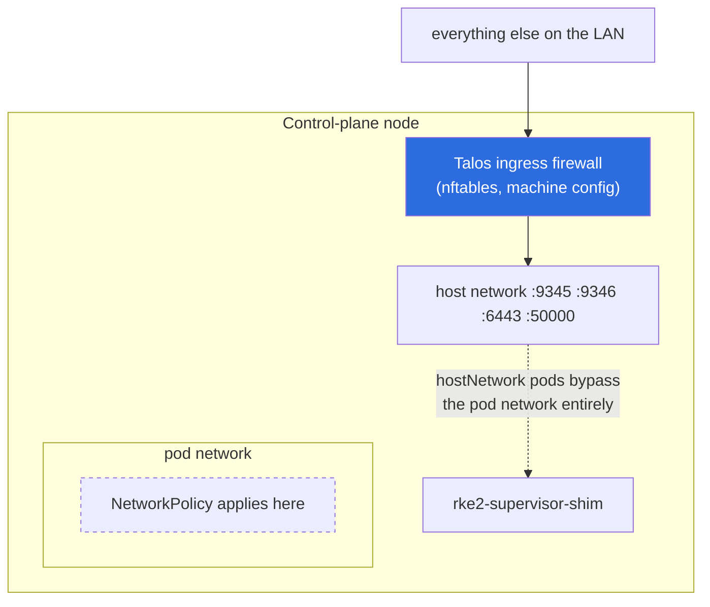

# Network security

## The problem NetworkPolicy cannot solve

The shim runs with `hostNetwork: true`, and that is not negotiable: after
bootstrap an rke2 agent dials `<apiserver-ip>:9345` for the tunnel, taking the
address from `/v1-rke2/apiservers`, so the supervisor must listen on the
control-plane node's own address.

**Kubernetes NetworkPolicy does not apply to hostNetwork pods.** Their traffic
reaches the node's network stack directly and never traverses the pod network,
so a `podSelector` policy for `:9345` would look like protection and provide
none. This is the single most important thing to understand here.



So enforcement has to happen at the host. Three layers, in order of what
actually does the work:

| Layer | File | Applies to hostNetwork? |
| --- | --- | --- |
| Talos ingress firewall | `deploy/talos-ingress-firewall.yaml` | **yes** — the real control |
| Cilium host firewall | `deploy/cilium-host-policy.yaml` | yes, if Cilium with `hostFirewall.enabled` |
| Kubernetes NetworkPolicy | `deploy/network-policy.yaml` | no — default-deny floor for other pods |

## Layer 1: the Talos ingress firewall

Talos drives nftables from machine config — no CNI involvement, no extra
components. This is the control to rely on.

### Port matrix for a control-plane node running the shim

Taken from `talosctl netstat --listening` on a live node, not from documentation.

| Port | Service | Who should reach it |
| --- | --- | --- |
| 50000/tcp | apid (`talosctl`) | management network only |
| 50001/tcp | trustd | cluster nodes |
| 6443/tcp | kube-apiserver | management + cluster nodes |
| 2379-2380/tcp | etcd | **control-plane peers only** |
| 10250/tcp | kubelet | cluster nodes |
| 10256/tcp | kube-proxy health | cluster nodes |
| **9345/tcp** | **shim supervisor** | **nodes allowed to join** |
| **9346/tcp** | **shim metrics** | **the scraper only** |
| 4789/udp | flannel VXLAN | cluster nodes (Cilium uses 8472) |

Everything else the node listens on — KubePrism 7445, scheduler 10259,
controller-manager 10257, kubelet healthz 10248, kube-proxy metrics 10249, host
DNS — binds to `127.0.0.1` or a link-local address and is unreachable from
outside regardless.

Why 9345 deserves a tight subnet: anything that can reach it **and** holds the
join token can enrol a node into your cluster. Why 9346 deserves one: the
metrics are unauthenticated and disclose node names and certificate expiry.

### Applying it safely

A default action of `block` with one rule missing locks out `talosctl` **and**
`kubectl` at the same time.

> **`--mode=try` did NOT roll this back when we tested it.** The patch was
> applied with `--mode=try --timeout=6m`; long after the timeout the ten
> firewall documents were still present in the machine config and the rules were
> still enforcing. Talos' try-mode rollback appears not to cover *additional
> config documents* the way it covers edits to the `v1alpha1` document.
>
> **Do not rely on try-mode as your safety net for this patch.** Keep an
> independent path to the machine — the hypervisor console, or a second
> control-plane node you have not patched yet — before you apply.

```bash
talosctl patch mc -n <cp-ip> --patch @deploy/talos-ingress-firewall.yaml
```

Substitute `$CLUSTER_SUBNET`, `$WORKER_SUBNET`, `$MGMT_SUBNET`, `$MONITORING`
and `$CP1..3` first. Roll forward one node at a time and verify each before
moving on.

To remove the firewall again, re-apply a machine config without these documents:

```bash
talosctl apply-config -n <cp-ip> -f clusterconfig/<node>.yaml   # no firewall docs
```

### Verified on the maquette

Applied to a live control-plane node, with `$MONITORING` set to a single host:

```
NfTablesChain  ingress  filter  input  priority -140  policy drop   ← active

kubectl / talosctl                     still working
9345 from the rke2 worker              HTTP 200      (allowed)
9346 from the rke2 worker              blocked       (as intended)
9346 from the monitoring host          HTTP 200      (allowed)
rke2 pod -> ClusterIP + cluster DNS    PASS
```

Nothing in the cluster noticed. The rule set above is therefore known-complete
for this topology — add rules for anything else you run on the node.

## Layer 2: Cilium host firewall (optional)

Cilium is the one CNI that *can* police host traffic, via
`CiliumClusterwideNetworkPolicy` with a `nodeSelector` instead of an
`endpointSelector`. It requires `hostFirewall.enabled=true` in the Cilium
configuration, which is **not** the default.

Useful if you want this expressed as Kubernetes objects alongside your other
policy rather than as machine config — but the Talos firewall is simpler, has no
prerequisites, and keeps working if Cilium is degraded. Prefer it; treat Cilium
host policy as defence in depth, not a replacement.

See `deploy/cilium-host-policy.yaml`.

## Layer 3: NetworkPolicy

`deploy/network-policy.yaml` sets a default-deny floor for the `rke2-shim`
namespace. It does **not** protect the shim. It exists so that any pod later
added to that namespace is closed by default, and so the intent is recorded
where a reviewer will look.

Do not mistake it for coverage of `:9345`.

## Worker-side considerations

The rke2 workers are ordinary mutable Linux hosts and are outside Talos'
firewall. Worth restricting there too:

| Port | Service | Who |
| --- | --- | --- |
| 10250/tcp | kubelet | control-plane nodes only |
| 10256/tcp | kube-proxy health | cluster nodes |
| 4789/udp | VXLAN | cluster nodes |
| 22/tcp | SSH | management network only |

Note the KubePrism shim (`worker/components/kubeprism-shim.sh` in the maquette
repo) binds `127.0.0.1:7445`, so it needs no rule.

## Threat model in one paragraph

The asset is the cluster CA private key, held in the shim pod. Reaching `:9345`
without the token gets you a CA certificate from `/cacerts` and nothing else.
Reaching it *with* the token lets you enrol a new node — but not impersonate an
existing one, because the node password is required (see
[security.md](security.md), finding 1). Reaching `:9346` gets you node names and
expiry dates. Reaching the pod itself, or `exec`ing into it, gets you the CA key
and therefore the cluster. Restrict `:9345` to the subnet whose machines are
allowed to be nodes, restrict `:9346` to the scraper, and treat RBAC on the
`rke2-shim` namespace as control-plane-grade.
