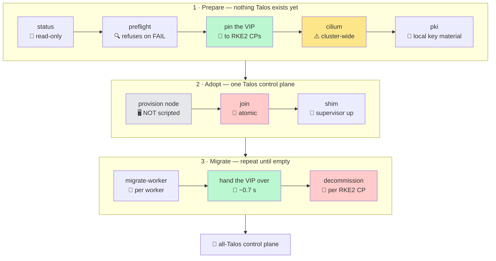
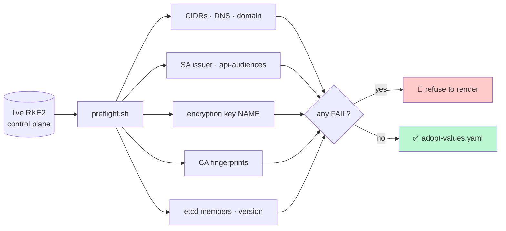
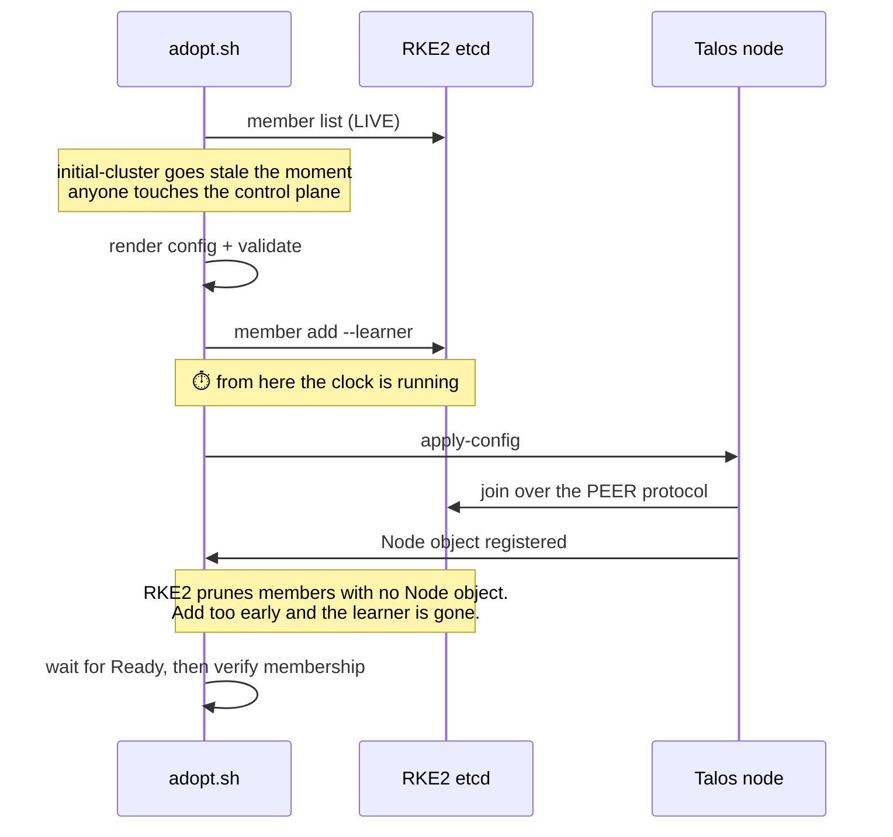
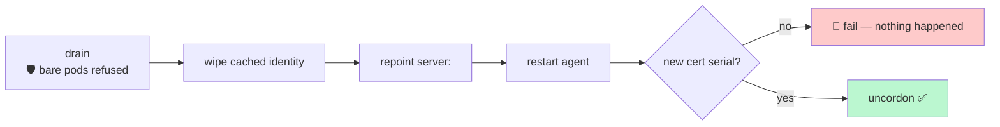

# Runbook — adopting an RKE2 cluster, phase by phase

Operational companion to [`adopt.sh`](../examples/adopt-rke2-cluster/adopt.sh).
The *why* behind each step is in [migration-from-rke2.md](migration-from-rke2.md);
the *reasons not to* are in [risk-register.md](risk-register.md). This document is
what you keep open while you run it.

```bash
export RKE2_SSH=user@rke2-cp-1      # any RKE2 control-plane node
export TALOS_VERSION=1.13           # the Talos minor you will install
./examples/adopt-rke2-cluster/adopt.sh status
```

> 🎫 **Use the RKE2 admin kubeconfig** (`/etc/rancher/rke2/rke2.yaml`) for the
> entire migration. It is the only credential that works against **both** control
> planes — the Talos one is rejected by RKE2 API servers, because its client cert
> chains to `server-ca` while RKE2 trusts `client-ca` only. Point it at the VIP
> and it keeps working across the handover.

## 🗺️ The whole path



> 🎈 The two green steps are the VIP, and their placement is load-bearing. Pin it
> to RKE2 **before** a Talos node exists, and hand it over only **after** every
> worker is migrated. Manifests and reasoning:
> [control-plane-vip.md](control-plane-vip.md).

Every phase is idempotent and verifies its own postcondition. A phase that
cannot verify itself exits non-zero and does **not** advance state, so re-running
after a failure is always safe.

## 📋 Phases at a glance

| Phase | Blast radius | Gate | Reversible | Proven |
|---|---|---|---|---|
| `status` | 👀 none — read only | — | n/a | ✅ tested live |
| `preflight` | 👀 none — read only | refuses to render if any check FAILs | n/a | ✅ tested live |
| `cilium` | 🌍 **every node in the cluster** | shows a diff, asks for `YES` | ✅ revert the HelmChartConfig | 🟡 no-change path only |
| `pki` | 💻 local disk only | preflight must pass | ✅ delete the workdir | ✅ tested live |
| `join` | 🗳️ **etcd quorum** | requires ≥3 members; waits for `Ready` | ⚠️ see recovery below | ✅ tested live |
| `shim` | 📡 one namespace | — | ✅ `helm uninstall` | ✅ self-scheduled onto the new CP |
| `migrate-worker` | 🖥️ one worker | safe drain; requires a **new cert serial** | ✅ repoint and re-run | ✅ tested both directions |
| `decommission` | 🗳️ **etcd quorum** | confirms on the **last** RKE2 CP | ❌ one-way on the last one | 🟡 tested, but not on the *last* CP |

> 🧪 **The whole path is now proven end to end** on a prod-shaped cluster: a
> **second** Talos control plane joined a live RKE2 cluster (4 etcd members),
> then an RKE2 control plane was decommissioned (back to 3), with no downtime
> and RKE2 never modified.
>
> Two things remain unexercised: removing the **last** RKE2 control plane — the
> one-way etcd version upgrade — and the `cilium` **applying** path on a cluster
> that does not already have the capability lists.

## ⏱️ What a run actually looks like

Durations measured on a 4-node prod-shaped lab unless marked *estimate*.

| Phase | Wall clock | What you watch |
|---|---|---|
| `preflight` | ~5 s | the FAIL/WARN list |
| `cilium` | 2–5 min *(estimate — only the no-change path was run)* | `cilium ready N/N`, nodes staying `Ready` |
| `pki` | ~15 s | files appearing in the workdir |
| `join` | **~3 min** (absent → NotReady at t+105s → Ready at t+180s) | node reaching `Ready`, then `etcd member list` |
| `migrate-worker` | ~40 s (10 s to a new cert, plus drain) | `cert=new` |
| VIP handover | **~0.7 s** of VIP outage | `plndr-cp-lock` holder changing |
| `decommission` | ~30 s | `etcd member list` shrinking |

### 🖥️ Provisioning the node (not scripted, but it will bite you)

Both of these present as *"the kernel hangs"*, and neither is Talos' fault:

- 🧠 **Talos requires x86-64-v2.** Proxmox defaults to `kvm64`, which does not
  provide it. The node stops dead at `Booting ...` with **no output at all** —
  no panic, no message. Use `--cpu host --machine q35`.
- ⌨️ **Talos' GRUB drives a serial terminal.** Without `--serial0 socket` the
  boot menu never counts down; you get a frozen `will be executed automatically
  in 2s` forever.

## 🔍 `preflight` — the safety mechanism

Reads the **live** control plane and refuses to generate a config if anything is
missing. This is not a convenience wrapper.

The failure mode it exists to prevent: for these parameters a Talos default is
never *unset*, it is **wrong but plausible**, and several fail late,
intermittently, or only after a leader election — long after the change that
caused them.



**Expected warnings on a normal RKE2 cluster** — these are informational, not
blockers:

- 🟡 `key name is 'aescbckey' but Talos hardcodes 'key1'` → the override is
  generated for you by `pki`
- 🟡 `RKE2 uses SEPARATE server-ca and client-ca` → expected; it is the reason
  the Talos apiserver cannot reach un-migrated RKE2 kubelets
- 🟡 `MIXED etcd: RKE2 runs 3.5.x, Talos ships 3.6.x` → note the snapshot
  requirement before the **last** decommission

## ⚠️ `cilium` — the one with cluster-wide blast radius

Talos runs a tighter capability bounding set, so Cilium's defaults die there with
`unable to apply caps: operation not permitted`. The fix lives in the **shared**
`HelmChartConfig`, which means applying it redeploys Cilium on **every** node,
RKE2 ones included.

> 🛑 Do this as its own deliberate step, verified, **before any Talos node
> exists**. If it goes wrong you want an unambiguous cause.

The script **merges** into the live values rather than replacing them. This
matters more than it sounds: `valuesContent` is the complete values block for the
chart, so writing a fresh manifest silently drops whatever was already there —
on the cluster this was developed against, that would have removed
`kubeProxyReplacement`, `k8sServiceHost` and `k8sServicePort`, breaking the CNI
everywhere at once.

If the capabilities are already present it makes **no change and no redeploy**.

**Recovery** — remove the manifest and let the helm-controller reconcile:

```bash
ssh $RKE2_SSH 'sudo rm /var/lib/rancher/rke2/server/manifests/rke2-cilium-talos.yaml'
```

## 🛑 `join` — the atomic phase

The one place where sequence is load-bearing. A human reliably loses this race;
a script does not, which is the entire reason it is scripted.



Three things the script enforces, each learned by getting it wrong:

- 🗳️ **≥3 existing members.** Adding to a one-member etcd takes quorum from 1 to
  2 and the cluster stops serving instantly.
- 🎓 **`--learner`, always.** A learner does not vote, so quorum is unaffected
  until Talos promotes itself.
- ⏱️ **Add, then apply immediately.** RKE2 prunes etcd members that have no
  `Node` object. A learner added minutes early is pruned, and `initial-cluster`
  then fails `validating peerURLs`.

### 🚑 If `join` fails after the member was added

**Remove the learner before retrying.** This is the one recovery step you must
not skip — leaving it behind means the next attempt's `initial-cluster` names a
member that RKE2 has since pruned.

```bash
# find the id, then remove it
./adopt.sh status
ssh $RKE2_SSH 'sudo ... etcdctl member remove <id>'
```

Then re-run `join`. It regenerates `initial-cluster` from a fresh member list.

## 🔁 `migrate-worker` — no OS rebuild

The agent re-bootstraps from the join token and its node password, so wiping its
cached identity is enough. **Reversible**: node-password hashes are byte-
compatible in both directions, so a worker can be moved back to a stock
`rke2-server` the same way.



> 🧠 **Why the certificate serial, and not just `Ready`?** The kubelet takes
> ~40 s to be marked `NotReady`, so a poll started right after the restart sees
> the **stale** `Ready` from before the migration and declares success with
> nothing having happened. Only a completed re-bootstrap produces a new serial.

**Bare pods.** Drain defaults to safe and refuses pods with no controller,
listing them by name — on a real cluster those are the ones nobody can recreate.
After you have looked at them:

```bash
ADOPT_DRAIN_FORCE=1 ./adopt.sh migrate-worker user@worker https://<talos>:9345
```

## 💣 Before the last RKE2 CP: fix the controller-manager signer

> **Do this while RKE2 is still running.** Apply
> [`controller-manager-signer.yaml`](../examples/adopt-rke2-cluster/controller-manager-signer.yaml)
> to every Talos control plane.
>
> `kube-controller-manager`'s CSR signer refuses a multi-certificate CA file, and
> the adoption *requires* one. RKE2's controller-manager holds the lease for the
> whole migration, so nothing complains — until the last RKE2 control plane
> leaves, a Talos one takes over, and **all three crashloop at once**. Every
> controller stops: DaemonSets stop reconciling, Deployments freeze, nodes stop
> being managed. The cluster looks fine (`kubectl get nodes` is served by the
> apiservers) while nothing is actually being driven.
>
> The symptom is far from the cause. What you see is a DaemonSet whose
> `observedGeneration` is stuck behind `generation`. What you get from
> `talosctl logs` is:
>
> ```
> failed to start kubernetes.io/kubelet-serving certificate controller:
>   error reading CA cert file ...: expected 1 certificate, found 2
> ```
>
> Verify afterwards, on **each** control plane:
>
> ```bash
> talosctl -n <ip> containers -k | grep kube-controller-manager
> # want CONTAINER_RUNNING, not CONTAINER_EXITED
> ```

## 🧹 `decommission` — mind the last one

> 🛑 **The final RKE2 control plane cannot be removed by the driver.** Every
> `rke2_kubectl` call goes through `$RKE2_SSH`, which stops answering the moment
> `rke2-server` does — and by definition there is no other RKE2 node to move to.
> Finish that one by hand, from a Talos node:
>
> ```bash
> talosctl -n <talos-ip> etcd members            # note the hex ID, not the name
> talosctl -n <talos-ip> etcd remove-member <hex-id>
> kubectl --server=https://<talos-ip>:6443 delete node <last-rke2-cp>
> # ^ this HANGS. rke2's own controllers hold finalizers
> #   (wrangler.cattle.io/node, .../managed-etcd-controller) and are no longer
> #   running to clear them, so the node sits in Terminating forever:
> kubectl ... patch node <last-rke2-cp> -p '{"metadata":{"finalizers":null}}' --type=merge
> ```
>
> Safe here because RKE2 is already stopped and its etcd member already removed —
> the finalizers exist for cleanup that can no longer happen.

Removing RKE2 control planes one at a time is unremarkable **until the last
one**.

> 🛑 **Removing the final RKE2 control plane silently upgrades the etcd cluster
> version.** Talos ships a newer etcd than RKE2 bundles (3.6 vs 3.5). The cluster
> version pins to the lowest member, so nothing looks wrong — then the last 3.5
> member leaves and it auto-upgrades. That is a **one-way door**: going back
> needs an explicit etcd downgrade procedure.

The script detects this and requires you to type `YES`. **Take a snapshot first.**

## 🧯 Rollback matrix

| Failed at | State | How to get back |
|---|---|---|
| `preflight` | 😌 nothing changed | fix the reported check |
| `cilium` | 🌍 Cilium redeployed cluster-wide | remove the manifest, let helm-controller reconcile |
| `pki` | 💻 local files only | delete the workdir |
| `join`, before apply | 🎓 a learner exists | **remove the member**, then retry |
| `join`, after apply | 🖥️ node booting, may be broken | `talosctl -n <ip> dmesg \| tail`; remove the member; wipe and retry |
| `migrate-worker` | 🚧 node cordoned, not migrated | repoint `server:` back, re-run, then `uncordon` |
| `decommission` | 🗳️ member removed | re-add as a learner and re-join, **unless** it was the last 3.5 member |

## ✅ What good looks like

```
==> Adoption state
  ✓ 1 Talos node(s) in the cluster
  ✓ shim running on 1 node(s)
  ✓ Cilium HelmChartConfig carries the Talos capability lists
```

## 🧭 During coexistence: leave the kubeconfig alone

One rule, not a per-node decision:

> 🎯 **Keep your kubeconfig — and any VIP in front of `:6443` — on the RKE2 API
> servers for the whole coexistence window.** Switch to Talos only when the last
> RKE2 control plane is about to go.

Better still, make it structural rather than a convention: pin kube-vip to RKE2
control planes by label **value**, so the VIP *cannot* land on a Talos API
server and nobody can hit the `401` by accident. Full per-phase configuration,
including the no-outage handover, is in
[control-plane-vip.md](control-plane-vip.md).

That makes **every workload node reachable at all times**:

| target | via an RKE2 API server |
|---|---|
| RKE2 control-plane nodes | ✅ |
| un-migrated workers | ✅ |
| migrated workers | ✅ |
| Talos control-plane nodes | ❌ `502` — use `talosctl` |

For the Talos nodes, `talosctl` is the better tool anyway — it does not depend on
the Kubernetes API, which is exactly what you want when debugging a control
plane:

```bash
talosctl -n <ip> logs -k kube-system/<pod>:<container>
talosctl -n <ip> containers -k
talosctl -n <ip> dmesg
```

Do **not** try to fix the `401` by redirecting Talos' kubelet-client cert — both
routes are closed on Talos 1.13 and each one takes the node down. The reasoning,
with the exact errors, is in
[kubelet-egress.md](kubelet-egress.md#why-the-401-is-not-worth-fixing). 🎯
